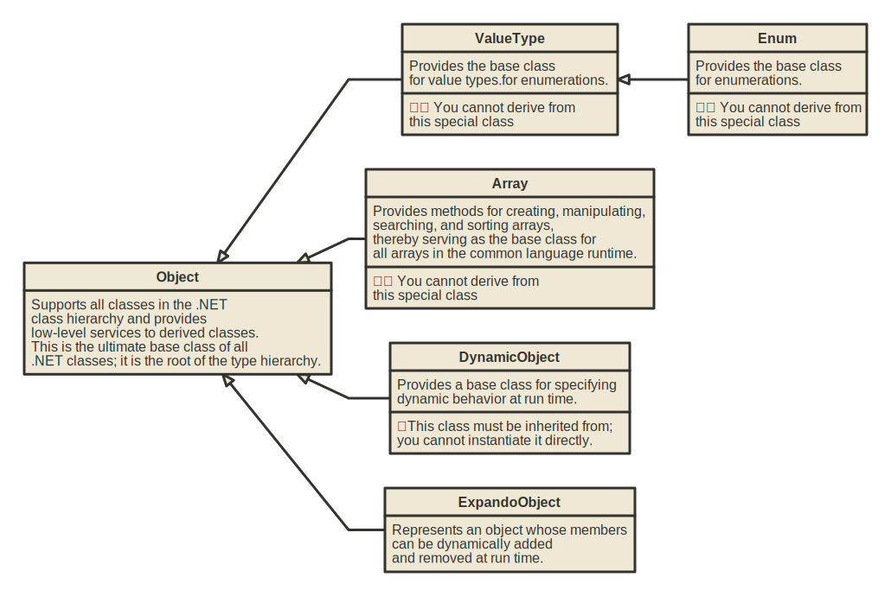

# Basic type system

^^^

^^^ Base classes

## Numerical types

|  Type   | bytes  |   Bits   |                    Minimum value                     |                   Maximum  Value                    |
| :-----: | :----: | :------: | :--------------------------------------------------: | :-------------------------------------------------: |
|  byte   |   1    |    8     |                          0                           |                         255                         |
|  sbyte  |   1    |    8     |                         -127                         |                         127                         |
|  short  |   2    |    16    |                       -32 768                        |                       32 767                        |
| ushort  |   2    |    16    |                          0                           |                       65 535                        |
|   int   |   4    |    32    |                    -2 147 483 648                    |                    2 147 483 647                    |
|  uint   |   4    |    32    |                          0                           |                    4 294 967 295                    |
|  long   |   8    |    64    |              -9 223 372 036 854 775 808              |              9 223 372 036 854 775 807              |
|  ulong  |   8    |    64    |                          0                           |             18 446 744 073 709 551 615              |
| Int128  |   16   |   128    | -170 141 183 460 469 231 731 687 303 715 884 105 728 | 170 141 183 460 469 231 731 687 303 715 884 105 727 |
| UInt128 |   16   |   128    |                          0                           | 340 282 366 920 938 463 463 374 607 431 768 211 455 |
|  nint   | 4 or 8 | 32 or 64 |          platform dependent signed integer           |          platform dependent signed integer          |
|  nuint  | 4 or 8 | 32 or 64 |         platform dependent unsigned integer          |         platform dependent unsigned integer         |
|  float  |   4    |    32    |             -3.4028235 x 1038             |             3.4028235 x 1038             |
| double  |   8    |    64    |        -1.7976931348623157 x 10308        |        1.7976931348623157 x 10308        |
| decimal |   16   |   128    |               -7.92 x 10 28               |               7.92 x 10 28               |
|  Half   |   2    |    16    |                       -65 504                        |                       65 504                        |

Note: `nint` and `nuint` represent the platforms native integer type. For 32 bit systems this will be a 32 bit integer, so the limitations and properties of `int`
 or `uint` aplies. On 64 bit systems the limitations and properties of `long` and `ulong` applies.

**Smallest representable number in floating types, that is not zero:**

* `decimal`: 1.0 x 10-28
* `double` : 5.0 x 10-324
* `float` : 1.0 x 10-45
* `Half`: 6.0 x 10-8

## Numerical types provided by .NET

* **System.Numerics.BigInteger** : Represents an arbitrarily large signed integer.
* **System.Numerics.Complex** : Represents a complex number.
* **System.Numerics.Matrix3x2** : Represents a 3x2 matrix.
* **System.Numerics.Matrix4x4** : Represents a 4x4 matrix.
* **System.Numerics.Plane** : Represents a plane in three-dimensional space.
* **System.Numerics.Quaternion** : Represents a vector that is used to encode three-dimensional physical rotations.
* **System.Numerics.Vector2** : Represents a vector with two single-precision floating-point values.
* **System.Numerics.Vector3** : Represents a vector with three single-precision floating-point values.
* **System.Numerics.Vector4** : Represents a vector with four single-precision floating-point values.

## Generic Math Interfaces

^^^

^^^ Generic Math Interfaces

* `IComparable<T>` 

    Defines a generalized comparison method that a value type or class implements to create a type-specific comparison method for ordering or sorting its instances.

* `IConvertible`

    Defines methods that convert the value of the implementing reference or value type to a common language runtime type that has an equivalent value.

* `IEquatable<T>`

    Defines a generalized method that a value type or class implements to create a type-specific method for determining equality of instances.

* `IParsable<T>`

    Defines a mechanism for parsing a string to a value.

* `ISpanParsable<T>`

    Defines a mechanism for parsing a span of characters to a value.

* `IAdditionOperators<TSelf,TSelf,TSelf>`

    Defines a mechanism for computing the sum of two values. Provides operators: `+`

* `IBitwiseOperators<TSelf,TSelf,TSelf>`

    Defines a mechanism for performing bitwise operations over two values. Provides operators: `&`, `|`, `^`, `~`

* `IComparisonOperators<TSelf,TSelf,bool>`

    Defines a mechanism for comparing two values to determine relative order. Provides operators: `>`, `>=`, `<`, `<=` 

* `IDecrementOperators<T>`

    Defines a mechanism for decrementing a given value. Provides operators: `--`

* `IDivisionOperators<TSelf,TSelf,TSelf>`

    Defines a mechanism for computing the quotient of two values. Provides operators: `/`

* `IEqualityOperators<TSelf,TSelf,bool>`

    Defines a mechanism for comparing two values to determine equality. Provides operators: `==`, `!=`

* `IIncrementOperators<T>`

    Defines a mechanism for incrementing a given value. Provides operators: `++`

* `IModulusOperators<TSelf,TSelf,TSelf>`

    Defines a mechanism for computing the modulus or remainder of two values. Provides operators: `%`

* `IMultiplyOperators<TSelf,TSelf,TSelf>`

    Defines a mechanism for computing the product of two values. Provides operators: `*`

* `IShiftOperators<TSelf,int,TSelf>`

    Defines a mechanism for shifting a value by another value. Provides operators: `<<`, `>>`, `<<<`

* `ISubtractionOperators<TSelf,TSelf,TSelf>`

    Defines a mechanism for computing the difference of two values. Provides operators: `-`

* `IUnaryNegationOperators<TSelf,TSelf>`

    Defines a mechanism for computing the unary negation of a value. Provides operators: `-`

* `IUnaryPlusOperators<TSelf,TSelf>`

    Defines a mechanism for computing the unary plus of a value. Provides operators: `+`

* `IAdditiveIdentity<TSelf,TSelf>`

    Defines a mechanism for getting the additive identity of a given type.

* `IMultiplicativeIdentity<TSelf,TSelf>`

    Defines a mechanism for getting the multiplicative identity of a given type.

* `IMinMaxValue<T>`

    Defines a mechanism for getting the minimum and maximum value of a type.

* `IExponentialFunctions<T>`

    Defines support for exponential functions.

* `IFloatingPointConstants<T>`

    Defines support for floating-point constants, like `E`, `Pi`, `Tau`

* `IHyperbolicFunctions<T>`

    Defines support for hyperbolic functions.

* `ILogarithmicFunctions<T>`

    Defines support for logarithmic functions.

* `IPowerFunctions<T>`

    Defines support for power functions.

* `IRootFunctions<T>`

    Defines support for root functions.

* `ITrigonometricFunctions<T>`

    Defines support for trigonometric functions.

|             Interfaces / Types             | SByte, Int16, Int32, Int64 | Int128 | Byte, UInt16, UInt32, UInt64 | UInt128 | Half  | Single, Double | Decimal | Complex | BigInteger |
| :----------------------------------------: | :------------------------: | :----: | :--------------------------: | :-----: | :---: | :------------: | :-----: | :-----: | :--------: |
|              `INumberBase<T>`              |             √              |   √    |              √               |    √    |   √   |       √        |    √    |    √    |     √      |
|                `INumber<T>`                |             √              |   √    |              √               |    √    |   √   |       √        |    √    |         |     √      |
|             `ISignedNumber<T>`             |             √              |   √    |                              |         |   √   |       √        |    √    |    √    |     √      |
|          `IUnsignedNumber<Tself>`          |                            |        |              √               |    √    |       |                |         |         |            |
|             `IBinaryNumber<T>`             |             √              |   √    |              √               |    √    |   √   |       √        |         |         |     √      |
|            `IBinaryInteger<T>`             |             √              |   √    |              √               |    √    |       |                |         |         |     √      |
|            `IFloatingPoint<T>`             |                            |        |                              |         |   √   |       √        |    √    |         |            |
|         `IFloatingPointIeee754<T>`         |                            |        |                              |         |   √   |       √        |         |         |            |
|      `IBinaryFloatingPointIeee754<T>`      |                            |        |                              |         |   √   |       √        |         |         |            |
|              `IComparable<T>`              |             √              |   √    |              √               |    √    |   √   |       √        |    √    |         |     √      |
|               `IConvertible`               |             √              |        |              √               |         |       |       √        |    √    |         |            |
|              `IEquatable<T>`               |             √              |   √    |              √               |    √    |   √   |       √        |    √    |    √    |     √      |
|               `IParsable<T>`               |             √              |   √    |              √               |    √    |   √   |       √        |    √    |    √    |     √      |
|             `ISpanParsable<T>`             |             √              |   √    |              √               |    √    |   √   |       √        |    √    |    √    |     √      |
|  `IAdditionOperators<TSelf,TSelf,TSelf>`   |             √              |   √    |              √               |    √    |   √   |       √        |    √    |    √    |     √      |
|   `IBitwiseOperators<TSelf,TSelf,TSelf>`   |             √              |   √    |              √               |    √    |   √   |       √        |         |         |     √      |
|  `IComparisonOperators<TSelf,TSelf,bool>`  |             √              |   √    |              √               |    √    |   √   |       √        |    √    |         |     √      |
|          `IDecrementOperators<T>`          |             √              |   √    |              √               |    √    |   √   |       √        |    √    |    √    |     √      |
|  `IDivisionOperators<TSelf,TSelf,TSelf>`   |             √              |   √    |              √               |    √    |   √   |       √        |    √    |    √    |     √      |
|   `IEqualityOperators<TSelf,TSelf,bool>`   |             √              |   √    |              √               |    √    |   √   |       √        |    √    |    √    |     √      |
|          `IIncrementOperators<T>`          |             √              |   √    |              √               |    √    |   √   |       √        |    √    |    √    |     √      |
|   `IModulusOperators<TSelf,TSelf,TSelf>`   |             √              |   √    |              √               |    √    |   √   |       √        |    √    |         |     √      |
|  `IMultiplyOperators<TSelf,TSelf,TSelf>`   |             √              |   √    |              √               |    √    |   √   |       √        |    √    |    √    |     √      |
|     `IShiftOperators<TSelf,int,TSelf>`     |             √              |   √    |              √               |    √    |       |                |         |         |     √      |
| `ISubtractionOperators<TSelf,TSelf,TSelf>` |             √              |   √    |              √               |    √    |   √   |       √        |    √    |    √    |     √      |
|   `IUnaryNegationOperators<TSelf,TSelf>`   |             √              |   √    |              √               |    √    |   √   |       √        |    √    |    √    |     √      |
|     `IUnaryPlusOperators<TSelf,TSelf>`     |             √              |   √    |              √               |    √    |   √   |       √        |    √    |    √    |     √      |
|      `IAdditiveIdentity<TSelf,TSelf>`      |             √              |   √    |              √               |    √    |   √   |       √        |    √    |    √    |     √      |
|   `IMultiplicativeIdentity<TSelf,TSelf>`   |             √              |   √    |              √               |    √    |   √   |       √        |    √    |    √    |     √      |
|             `IMinMaxValue<T>`              |             √              |   √    |              √               |    √    |   √   |       √        |    √    |         |            |
|         `IExponentialFunctions<T>`         |                            |        |                              |         |   √   |       √        |         |         |            |
|        `IFloatingPointConstants<T>`        |                            |        |                              |         |   √   |       √        |    √    |         |            |
|         `IHyperbolicFunctions<T>`          |                            |        |                              |         |   √   |       √        |         |         |            |
|         `ILogarithmicFunctions<T>`         |                            |        |                              |         |   √   |       √        |         |         |            |
|            `IPowerFunctions<T>`            |                            |        |                              |         |   √   |       √        |         |         |            |
|            `IRootFunctions<T>`             |                            |        |                              |         |   √   |       √        |         |         |            |
|        `ITrigonometricFunctions<T>`        |                            |        |                              |         |   √   |       √        |         |         |            |
