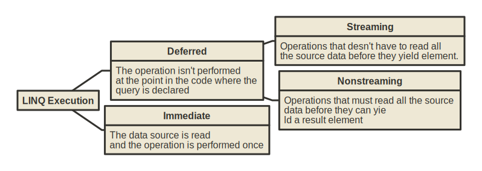

# LINQ

Language-Integrated Query (LINQ) is the name for a set of technologies based on the integration of query capabilities directly into the C# language. With LINQ, a query is a first-class language construct, just like classes, methods, and events.

The LINQ to Objects works with any collection that implements the `IEnumerable<T>` interface.

^^^

^^^ The IEnumerable\<T\> interface

## Filtering

```csharp
var customerOrders = Orders.Where(order => order.CustomerId == 66);
```

## Select with anonymus type

```csharp
var ordersWithCost = Orders.Select(order => new
{
    OrderId = order.Id,
    Cost = order.Cost,
});
```

## Distinct

```csharp
//The Distinct method requires equality implementation on the class or 
//an IEqualityComparer as parameter
var uniqueNames = customer.Distinct((customerComparer);

//DistinctBy requires a lambda
var uniqueNames = customer.DistinctBy(√ => √.Name); 
```

## Ordering

```csharp
var ascendingOrder = orders.OrderBy(order => order.Cost);
var descendingOrder = orders.OrderByDescending(order => order.Cost);

var multipleOdering = orders.OrderBy(order => order.Cost).ThenBy(order => order.CustomerId);
```

Note: Result will be an `IOrderedEnumerable<TElement>`.

## Join

```csharp
var joined = customers.Join(orders, 
                            customer => customer.Id, 
                            order => order.CustomerId
                            (customer, order) => new
                            {
                                CustomerId = customer.Id,
                                Name = customer.Name,
                                Cost = order.Cost, 
                            });
```

## Grouping

```csharp
var grouped = orders.GroupBy(order => CustomerId);
```

Note: Result will be an `IGrouping<TKey,TElement>`

## Lookup

```csharp
var packagesByCompany = packages.ToLookup(oder => oder.Date,  order => order.id); 
```

Note: Result will be an `ILookup<TKey,TElement>`, which is a one-to-many dictionary that maps keys to collections of values.

## Zip

Zip creates an Enumerable of tuples, where the first element of the tuple is the element from the first sequence and the second element is the element from the second sequence.

```csharp
int[] first = [1, 2, 3];
string[] second = ["a", "b", "c"];
//Returns [(1, "a"), (2, "b"), (3, "c")]
first.Zip(second); 
```

## Skip & Take

```csharp
var take3 = orders.Take(3);
var ne√t3 = orders.Skip(3).Take(3);
```

## Element operations

```csharp
//throws e√ception if element not found
var firstCustomer = customers.First(customer => customer.Id == 63);
var lastCustomer = customers.Last(customer => customer.Id == 63);
//returns default value if element not found. For refenrence types this is null!
var firstCustomer = customers.FirstOrDefault(customer => customer.Id == 63);
var lastCustomer = customers.LastOrDefault(customer => customer.Id == 63);
//You can specify the default return value with the 2nd parameter:
var firstCustomer = customers.FirstOrDefault(customer => customer.Id == 63, new Cutomer());
var lastCustomer = customers.LastOrDefault(customer => customer.Id == 63, new Customer());
```

## Conversions

```csharp
Order[] orders = Orders.Where(order => order.CustomerId == 66).ToArray();
List<Order> orders = Orders.Where(order => order.CustomerId == 66).ToList();
HashSet<Order> orders = Orders.Where(order => order.CustomerId == 66).ToHashSet();
Dictionary<int, string> customerDictionary
     = Customers.ToDictionary(customer => customer.Id, customer => customer.Name);
```

## Enumerable class

```csharp
//Create a range of numbers from 0 to 9
IEnumerable<int> range = Enumerable.Range(0, 10);
//Create a sequence of 12 "foo" strings
IEnumerable<string> foos = Enumerable.Repeat("foo", 12);
//Create an empty sequence of integers
IEnumerable<int> empty = Enumerable.Empty<int>();
```

## Linq Execution

^^^

^^^ Classification of standard query operators by manner of execution

| Standard query operator |                  Return type                   | Immediate | Deferred streaming | Deferred nonstreaming |
| :---------------------: | :--------------------------------------------: | :-------: | :----------------: | :-------------------: |
|        Aggregate        |                   `TSource`                    |     √     |                    |                       |
|           All           |                     `bool`                     |     √     |                    |                       |
|           Any           |                     `bool`                     |     √     |                    |                       |
|      AsEnumerable       |                `IEnumerable<T>`                |           |         √          |                       |
|         Average         |              Single numeric value              |     √     |                    |                       |
|          Cast           |                `IEnumerable<T>`                |           |         √          |                       |
|         Concat          |                `IEnumerable<T>`                |           |         √          |                       |
|        Contains         |                     `bool`                     |     √     |                    |                       |
|          Count          |                     `int`                      |     √     |                    |                       |
|     DefaultIfEmpty      |                `IEnumerable<T>`                |           |         √          |                       |
|        Distinct         |                `IEnumerable<T>`                |           |         √          |                       |
|        ElementAt        |                   `TSource`                    |     √     |                    |                       |
|   ElementAtOrDefault    |                   `TSource?`                   |     √     |                    |                       |
|          Empty          |                `IEnumerable<T>`                |     √     |                    |                       |
|         E√cept          |                `IEnumerable<T>`                |           |         √          |           √           |
|          First          |                   `TSource`                    |     √     |                    |                       |
|     FirstOrDefault      |                   `TSource?`                   |     √     |                    |                       |
|         GroupBy         |                `IEnumerable<T>`                |           |                    |           √           |
|        GroupJoin        |                `IEnumerable<T>`                |           |         √          |           √           |
|        Intersect        |                `IEnumerable<T>`                |           |         √          |           √           |
|          Join           |                `IEnumerable<T>`                |           |         √          |           √           |
|          Last           |                   `TSource`                    |     √     |                    |                       |
|      LastOrDefault      |                   `TSource?`                   |     √     |                    |                       |
|        LongCount        |                     `long`                     |     √     |                    |                       |
|           Ma√           | Single numeric value, `TSource`, or `TResult?` |     √     |                    |                       |
|           Min           | Single numeric value, `TSource`, or `TResult?` |     √     |                    |                       |
|         OfType          |                `IEnumerable<T>`                |           |         √          |                       |
|         OrderBy         |            `IOrderedEnumerable<T>`             |           |                    |           √           |
|    OrderByDescending    |            `IOrderedEnumerable<T>`             |           |                    |           √           |
|          Range          |                `IEnumerable<T>`                |           |         √          |                       |
|         Repeat          |                `IEnumerable<T>`                |           |         √          |                       |
|         Reverse         |                `IEnumerable<T>`                |           |                    |           √           |
|         Select          |                `IEnumerable<T>`                |           |         √          |                       |
|       SelectMany        |                `IEnumerable<T>`                |           |         √          |                       |
|      SequenceEqual      |                     `bool`                     |     √     |                    |                       |
|         Single          |                   `TSource`                    |     √     |                    |                       |
|     SingleOrDefault     |                   `TSource?`                   |     √     |                    |                       |
|          Skip           |                `IEnumerable<T>`                |           |         √          |                       |
|        SkipWhile        |                `IEnumerable<T>`                |           |         √          |                       |
|           Sum           |              Single numeric value              |     √     |                    |                       |
|          Take           |                `IEnumerable<T>`                |           |         √          |                       |
|        TakeWhile        |                `IEnumerable<T>`                |           |         √          |                       |
|         ThenBy          |            `IOrderedEnumerable<T>`             |           |                    |           √           |
|    ThenByDescending     |            `IOrderedEnumerable<T>`             |           |                    |           √           |
|         ToArray         |               `TSource[]` array                |     √     |                    |                       |
|      ToDictionary       |           `Dictionary<TKey, TValue>`           |     √     |                    |                       |
|         ToList          |                   `IList<T>`                   |     √     |                    |                       |
|        ToLookup         |                  `ILookup<T>`                  |     √     |                    |                       |
|          Union          |                `IEnumerable<T>`                |           |         √          |                       |
|          Where          |                `IEnumerable<T>`                |           |         √          |                       |