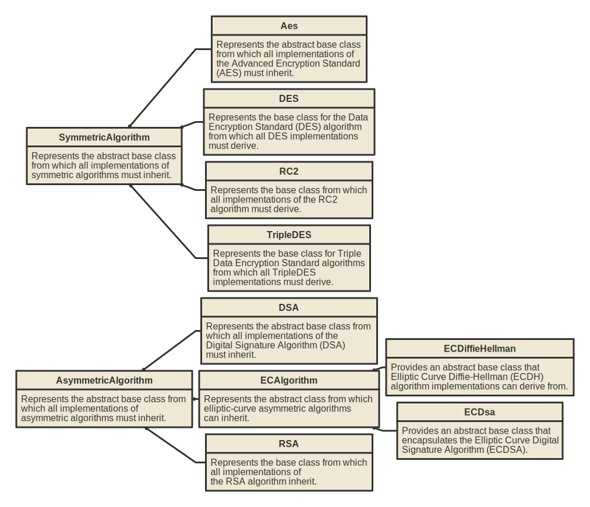
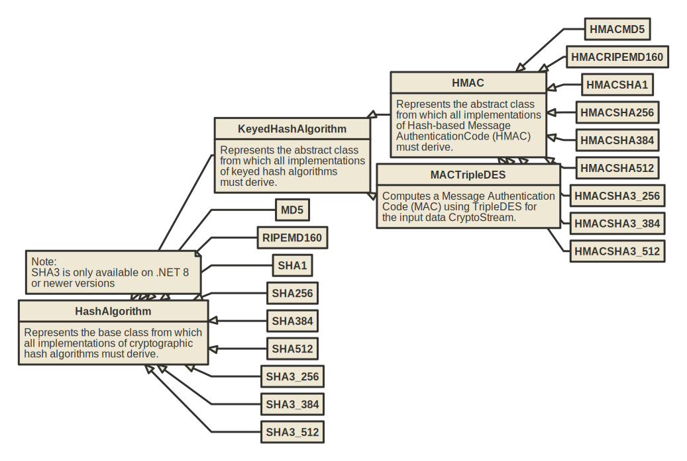

# Cryptography

## Encryption Algortithms

**Symmetric encryption**

Symmetric encryption is a cryptographic method where the same key is used for both encryption and decryption of data. In other words, the sender and the recipient use a shared secret key to encrypt and decrypt messages. It is commonly used in various applications, including securing data transmission over networks, encrypting files stored on disk, and protecting sensitive information in databases. 

**Asymmetric encryption**

Asymmetric encryption, also known as public-key cryptography, is a cryptographic method that uses two separate keys for encryption and decryption. A public, and a private key. The pair of keys are mathematically related, but distinct. It is widely used in various applications, including secure Communication, digital signatures and key exchange.

## Hash Algorithms

**Hash Algorithms**

A hash algorithm, also known as a cryptographic hash function, is a mathematical algorithm that takes an input (or "message") and produces a fixed-size string of bytes, which are typically represented as a hexadecimal number or it is base64 encoded.

Hash algorithms have several important properties: They are deterministic. For a given input, the hash algorithm always produces the same output and given a hash value, it should be computationally infeasible to determine the original input.

A cryptographic hash function is resilient to collision. It should be extremely unlikely for two different inputs to produce the same hash value. This property is crucial for ensuring the integrity of data. Even a small change in the input should result in a significantly different hash value.

Hash algorithms are widely used in cryptography for various purposes, including data integrity checks, digital signatures and password storage.

It's worth noting that while MD5 and SHA-1 were once widely used, they are now considered vulnerable to various attacks, and it's generally recommended to use stronger hash functions such as SHA-256 or SHA-3 for cryptographic purposes.

**HMAC**

Hash-based Message Authentication Code (HMAG), is a mechanism for generating a cryptographic hash of data in combination with a secret key. It provides a way to verify both the integrity and authenticity of a message.

HMAC takes two inputs - the message to be authenticated and a secret key known only to the sender and the receiver. It uses a cryptographic hash function (such as MD5, SHA-1, SHA-256) to process the message. The secret key is mixed with the message in a specific way, usually by XOR operations and padding, to create a unique digest. The mixed data is then hashed using the chosen hash function and the output of the hash function is the HMAC.

The recipient, who knows the secret key, can generate the HMAC using the received message and compare it to the transmitted HMAC. If they match, it indicates that the message has not been tampered with during transmission and that it was sent by someone with knowledge of the secret key.
