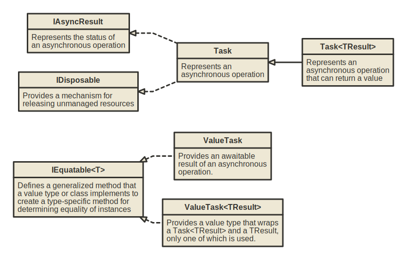

# Tasks

A Task in .NET represents an asynchronous operation that can return a result or complete without one. Tasks are used to perform background operations, avoiding blocking the main thread.

## Creating and Running Tasks

A Task can be started with the `Task.Run` method or alternatively with the `Task.Factory.StartNew` method.

```csharp
Task.Run(() => DoWork());

Task.Factory.StartNew(() => DoWork());
```

Tasks can return a result using `Task<T>` where `T` is the type of the result:

```csharp
Task<int> task = Task.Run(() => Compute());
```

## Task operations

The `Task.Wait()` Blocks the calling thread until the task finishes.

```csharp
task.Wait();
```

You can chain tasks by continuing them with `ContinueWith`.

```csharp
Task.Run(() => DoWork())
    .ContinueWith(t => Console.WriteLine("Task completed!"));
```

Tasks can be cancelled using a CancellationToken

```csharp
var tokenSource = new CancellationTokenSource();
var token = tokenSource.Token;

Task task = Task.Run(() => DoWork(token), token);

tokenSource.Cancel();  // Cancel the task
```

## Async await

The `async` and `await` keywords are used to write asynchronous code in a simplified manner. This is often combined with tasks to ensure non-blocking operations.

```csharp
public async Task DoWorkAsync() 
{
    await Task.Delay(1000);
    Console.WriteLine("Work completed");
}
```

## Task types

In C#, both `Task` and `ValueTask` are used to represent asynchronous operations, but they are optimized for different scenarios.

^^^

^^^ Task Types

### When to use a Task

* **Asynchronous method always completes asynchronously**: If the operation always runs asynchronously and returns a result in the future, use Task. The overhead of Task is justified for managing the state of the operation.
* **Long-running or CPU-bound operations**: When the operation involves long-running or CPU-intensive tasks, Task is the standard choice.
* **Multiple await points or continuations**: If the method has multiple asynchronous steps or continuations (e.g., several `await` calls), `Task` is better suited as it provides efficient memory management for complex operations.
* **Memory management is not a major concern**: In many scenarios, the additional memory overhead of `Task` is minimal and worth the simplicity it offers.
* **You expect consumers to use `.Result`, `.Wait()`, or `Task.WhenAll`**: Task handles these scenarios better because it is reference type and has additional functionality for managing asynchronous flows.

### When to use a ValueTask

* **Operation may complete synchronously**: If the operation sometimes completes synchronously (e.g., from a cache or optimized path), `ValueTask` avoids allocating a `Task` object unnecessarily.
* **Performance-sensitive, high-frequency methods**: In performance-critical code where the method is called frequently, and synchronous completions are common, It can reduce memory allocations and improve efficiency.
* **Low memory pressure is essential**: It is a value type, so it avoids heap allocations when it completes synchronously, which is useful in scenarios where memory allocation needs to be minimized.
* **Limited continuation and lifetime**: If you are sure that the `ValueTask` will only be awaited once (e.g., there are no complex continuations, multiple awaits, or reuse), it’s safe to use.
* **Pooling or caching scenarios**: When implementing methods that benefit from object pooling or where synchronous fast-path execution is common (like low-latency I/O or cached results), it is a good option.

### What not to do with ValueTasks

**If you do any of the following, then the results are undefined**:

* Awaiting the instance multiple times.
* Calling `AsTask()` multiple times.
* Using more than one of these techniques to consume the instance.

## Async/await best practices

### Avoid async void

Void-returning async methods have a specific purpose: to make asynchronous event handlers possible. Async void methods have different error-handling semantics. When an exception is thrown out of an `async Task` or `async Task<T>` method, that exception is captured and placed on the `Task` object. With async void methods, there is no `Task` object, so any exceptions thrown out of an `async void` method will be raised directly on the SynchronizationContext that was active when the `async void` method started.

```csharp
private async void ThrowExceptionAsync()
{
  throw new InvalidOperationException();
}

public void AsyncVoidExceptions_CannotBeCaughtByCatch()
{
  try
  {
    ThrowExceptionAsync();
  }
  catch (Exception)
  {
    // The exception is never caught here!
    throw;
  }
}
```

These exceptions can be observed using AppDomain.UnhandledException or a similar catch-all event.

### Async All the Way

“Async all the way” means that you shouldn’t mix synchronous and asynchronous code without carefully considering the consequences. In particular, it’s usually a bad idea to block on async code by calling Task.Wait or Task.Result. This is an especially common problem that can cause deadlocks.

```csharp
public static class DeadlockDemo
{
  private static async Task DelayAsync()
  {
    await Task.Delay(1000);
  }
  // This method causes a deadlock when called in a GUI or ASP.NET context.
  public static void Test()
  {
    // Start the delay.
    var delayTask = DelayAsync();
    // Wait for the delay to complete.
    delayTask.Wait();
  }
}
```

### Configure Context

By using `ConfigureAwait`, you enable a small amount of parallelism: Some asynchronous code can run in parallel with the GUI thread instead of constantly badgering it with bits of work to do. Aside from performance, ConfigureAwait has another important aspect: It can avoid deadlocks. 

You should not use ConfigureAwait when you have code after the await in the method that needs the context. For GUI apps, this includes any code that manipulates GUI elements, writes data-bound properties or depends on a GUI-specific type.

```csharp
private async Task HandleClickAsync()
{
  // Can use ConfigureAwait here.
  await Task.Delay(1000).ConfigureAwait(continueOnCapturedContext: false);
}
private async void button1_Click(object sender, EventArgs e)
{
  button1.Enabled = false;
  try
  {
    // Can't use ConfigureAwait here.
    await HandleClickAsync();
  }
  finally
  {
    // We are back on the original context for this method.
    button1.Enabled = true;
  }
}
```