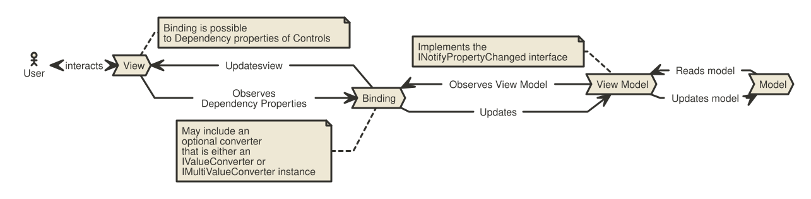

# UI

* **Windows Forms**

    Windows Forms is a UI framework for building Windows desktop apps. It provides one of the most productive ways to create desktop apps based on the visual designer provided in Visual Studio. Functionality such as drag-and-drop placement of visual controls makes it easy to build desktop apps.

* **WPF**

    Windows Presentation Foundation (WPF) is a UI framework that is resolution-independent and uses a vector-based rendering engine, built to take advantage of modern graphics hardware. WPF provides a comprehensive set of application-development features that include Extensible Application Markup Language (XAML), controls, data binding, layout, 2D and 3D graphics, animation, styles, templates, documents, media, text, and typography. WPF is part of .NET, so you can build applications that incorporate other elements of the .NET API.

* **MAUI**

    .NET Multi-platform App UI (.NET MAUI) is a cross-platform framework for creating native mobile and desktop apps with C# and XAML. Using .NET MAUI, you can develop apps that can run on Android, iOS, macOS, and Windows from a single shared code-base.

## MVVM

The MVVM pattern helps cleanly separate an application's business and presentation logic from its user interface (UI). Maintaining a clean separation between application logic and the UI helps address numerous development issues and makes an application easier to test, maintain, and evolve. It can also significantly improve code re-use opportunities and allows developers and UI designers to collaborate more easily when developing their respective parts of an app.
    
Frameworks:

* CommunityToolkit.Mvvm - https://learn.microsoft.com/en-us/dotnet/communitytoolkit/mvvm/
* ReactiveUI - https://www.reactiveui.net/
* Prism Libary - https://prismlibrary.com/

^^^

^^^ MVVM Data flow

### Minimal MVVM Implementation

```csharp
public abstract class ViewModelBase : INotifyPropertyChanged
{
    public event PropertyChangedEventHandler? PropertyChanged;

    protected void OnPropertyChanged(string propertyName = "") 
        => PropertyChanged?.Invoke(this, new PropertyChangedEventArgs(propertyName));

    protected void SetValue<T>(ref T field,
                               T newValue,
                               [CallerMemberName] string properyName = "")
    {
        if (!EqualityComparer<T>.Default.Equals(field, newValue))
        {
            field = newValue;
            OnPropertyChanged(properyName);
        }
    }

    protected void SetValue<T>(ref T field,
                               T newValue,
                               IEqualityComparer<T> comparer,
                               [CallerMemberName] string properyName = "")
    {
        if (!comparer.Equals(field, newValue))
        {
            field = newValue;
            OnPropertyChanged(properyName);
        }
    }
}
```

```csharp
public class RelayCommand : ICommand
{
    private readonly Action<object?> _acton;
    private readonly Predicate<object?>? _canExecute;

    public event EventHandler? CanExecuteChanged;

    public RelayCommand(Action<object?> acton, Predicate<object?>? canExecute = null)
    {
        _acton = acton;
        _canExecute = canExecute;
    }

    public void RaiseCanExecuteChanged()
        => CanExecuteChanged?.Invoke(this, EventArgs.Empty);

    public bool CanExecute(object? parameter)
        => _canExecute == null || _canExecute(parameter);

    public void Execute(object? parameter)
        => _acton.Invoke(parameter);
}
```
