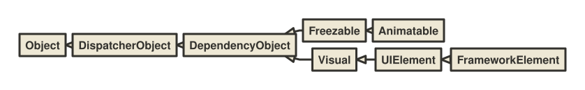
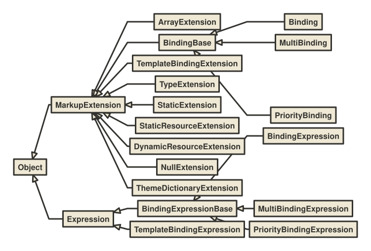
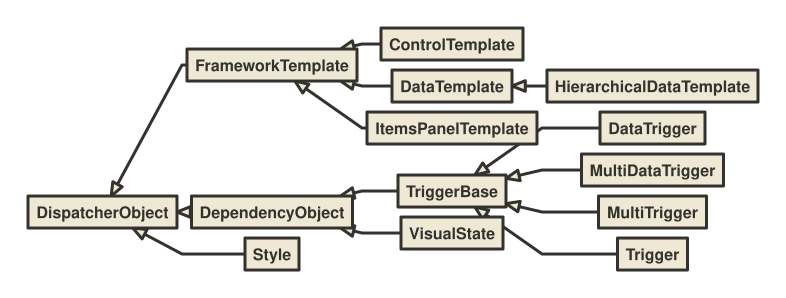
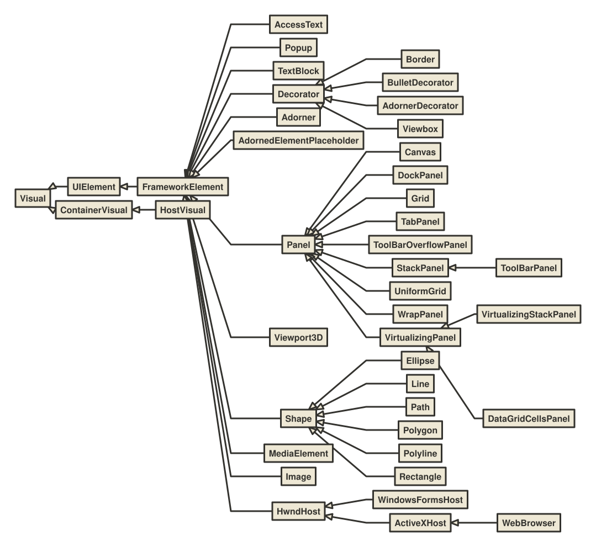
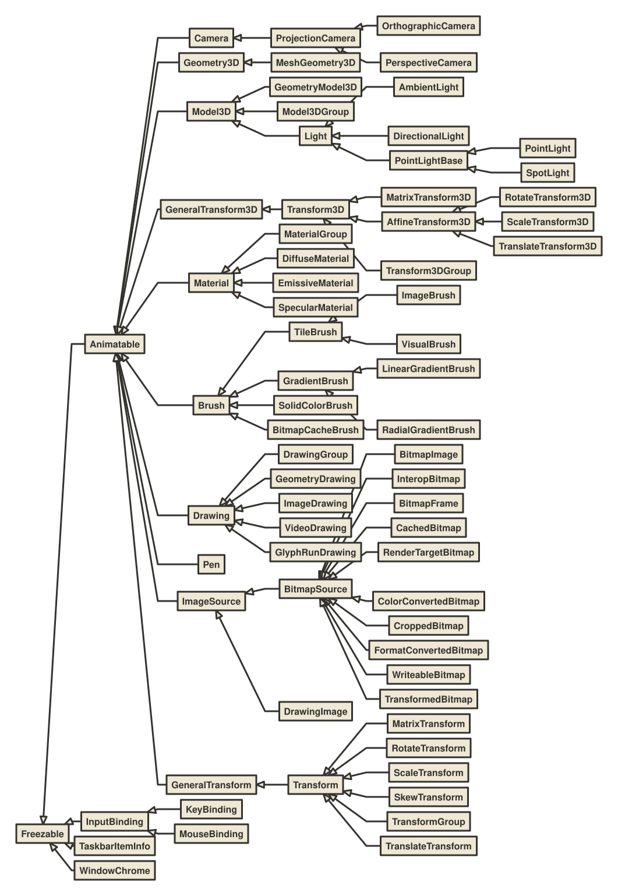
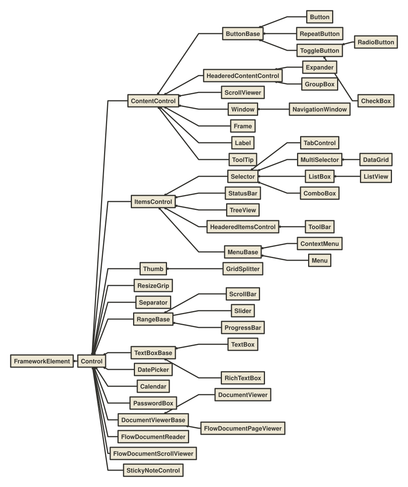
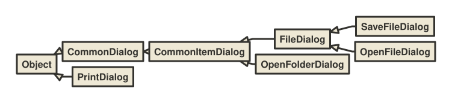

# WPF

## Base classes

* **DispatcherObject**

    Represents an object that is associated with a .

* **DependencyObject**

    Represents an object that participates in the dependency property system.

* **Freezable**

    Defines an object that has a modifiable state and a read-only (frozen) state. Classes that derive from  provide detailed change notification, can be made immutable, and can clone themselves.

* **Animatable**

    Abstract class that provides animation support.

* **Visual**

    Provides rendering support in WPF, which includes hit testing, coordinate transformation, and bounding box calculations.

* **UIElement**

     is a base class for WPF core level implementations building on Windows Presentation Foundation (WPF) elements and basic presentation characteristics.

* **FrameworkElement**

    Provides a WPF framework-level set of properties, events, and methods for Windows Presentation Foundation (WPF) elements. This class represents the provided WPF framework-level implementation that is built on the WPF core-level APIs that are defined by .

## Markup Extensions

* **BindingBase**

    Defines the common characteristics of the , , and  classes.

* **Binding**

    Provides high-level access to the definition of a binding, which connects the properties of binding target objects (typically, WPF elements), and any data source (for example, a database, an XML file, or any object that contains data).

* **MultiBinding**

    Describes a collection of  objects attached to a single binding target property.

* **PriorityBinding**

    Describes a collection of  objects that is attached to a single binding target property, which receives its value from the first binding in the collection that produces a value successfully.

* **Expression**

    This type supports the Windows Presentation Foundation (WPF) infrastructure and is not intended to be used directly from your code.

* **BindingExpressionBase**

    Represents the base class for , , and .

* **BindingExpression**

    Contains information about a single instance of a .

* **MultiBindingExpression**

    Contains instance information about a single instance of a .

* **TemplateBindingExtension**

    Implements a markup extension that supports the binding between the value of a property in a template and the value of some other exposed property on the templated control.

* **TemplateBindingExpression**

    Describes a run-time instance of a .

* **PriorityBindingExpression**

    Contains instance information about a single instance of a .

* **StaticResourceExtension**

    Implements a markup extension that supports static (XAML load time) resource references made from XAML.

* **DynamicResourceExtension**

    Implements a markup extension that supports dynamic resource references made from XAML.

* **ThemeDictionaryExtension**

    Implements a markup extension that enables application authors to customize control styles based on the current system theme.

## Templates

* **FrameworkTemplate**

    Enables the instantiation of a tree of  and/or  objects.

* **ControlTemplate**

    Specifies the visual structure and behavioral aspects of a  that can be shared across multiple instances of the control.

* **DataTemplate**

    Describes the visual structure of a data object.

* **HierarchicalDataTemplate**

    Represents a  that supports , such as  or .

* **ItemsPanelTemplate**

    Specifies the panel that the  creates for the layout of the items of an .

* **DependencyObject**

    Represents an object that participates in the dependency property system.

* **TriggerBase**

    Represents the base class for specifying a conditional value within a  object.

* **DataTrigger**

    Represents a trigger that applies property values or performs actions when the bound data meets a specified condition.

* **MultiDataTrigger**

    Represents a trigger that applies property values or performs actions when the bound data meet a set of conditions.

* **MultiTrigger**

    Represents a trigger that applies property values or performs actions when a set of conditions are satisfied.

* **Trigger**

    Represents a trigger that applies property values or performs actions conditionally.

* **Style**

    Enables the sharing of properties, resources, and event handlers between instances of a type.

* **VisualState**

    Represents the visual appearance of the control when it is in a specific state.

## FrameworkElement derivatives

* **Visual**

    Provides rendering support in WPF, which includes hit testing, coordinate transformation, and bounding box calculations.

* **UIElement**

     is a base class for WPF core level implementations building on Windows Presentation Foundation (WPF) elements and basic presentation characteristics.

* **AccessText**

    Specifies with an underscore the character that is used as the access key.

* **Popup**

    Represents a pop-up window that has content.

* **TextBlock**

    Provides a lightweight control for displaying small amounts of flow content.

* **Decorator**

    Provides a base class for elements that apply effects onto or around a single child element, such as  or .

* **Border**

    Draws a border, background, or both around another element.

* **BulletDecorator**

    Represents a layout control that aligns a bullet and another visual object.

* **AdornerDecorator**

    Provides an  for the child elements in the visual tree.

* **Viewbox**

    Defines a content decorator that can stretch and scale a single child to fill the available space.

* **Adorner**

    Abstract class that represents a  that decorates a .

* **AdornedElementPlaceholder**

    Represents the element used in a  to specify where a decorated control is placed relative to other elements in the .

* **Panel**

    Provides a base class for all  elements. Use  elements to position and arrange child objects in Windows Presentation Foundation (WPF) applications.

* **Canvas**

    Defines an area within which you can explicitly position child elements by using coordinates that are relative to the  area.

* **DockPanel**

    Defines an area where you can arrange child elements either horizontally or vertically, relative to each other.

* **Grid**

    Defines a flexible grid area that consists of columns and rows.

* **TabPanel**

    Handles the layout of the  objects on a .

* **ToolBarOverflowPanel**

    Used to arrange overflow  items.

* **StackPanel**

    Arranges child elements into a single line that can be oriented horizontally or vertically.

* **ToolBarPanel**

    Arranges  items inside a .

* **UniformGrid**

    Provides a way to arrange content in a grid where all the cells in the grid have the same size.

* **WrapPanel**

    Positions child elements in sequential position from left to right, breaking content to the next line at the edge of the containing box. Subsequent ordering happens sequentially from top to bottom or from right to left, depending on the value of the  property.

* **VirtualizingPanel**

    Provides a framework for  elements that virtualize their child data collection. This is an abstract class.

* **VirtualizingStackPanel**

    Arranges and virtualizes content on a single line that is oriented either horizontally or vertically.

* **DataGridCellsPanel**

    Represents a panel that lays out cells and column headers in a data grid.

* **Viewport3D**

    Renders the contained 3-D content within the 2-D layout bounds of the  element.

* **Shape**

    Provides a base class for shape elements, such as , , and .

* **Ellipse**

    Draws an ellipse.

* **Line**

    Draws a straight line between two points.

* **Path**

    Draws a series of connected lines and curves.

* **Polygon**

    Draws a polygon, which is a connected series of lines that form a closed shape.

* **Polyline**

    Draws a series of connected straight lines.

* **Rectangle**

    Draws a rectangle.

* **MediaElement**

    Represents a control that contains audio and/or video.

* **Image**

    Represents a control that displays an image.

* **HwndHost**

    Hosts a Win32 window as an element within Windows Presentation Foundation (WPF) content.

* **WindowsFormsHost**

    An element that allows you to host a Windows Forms control on a WPF page.

* **ActiveXHost**

    Hosts an ActiveX control as an element within Windows Presentation Foundation (WPF) content.

* **WebBrowser**

    Hosts and navigates between HTML documents. Enables interoperability between WPF managed code and HTML script.

* **ContainerVisual**

    Manages a collection of  objects.

* **HostVisual**

    Represents a  object that can be connected anywhere to a parent visual tree.

## Freezables

* **Freezable**

    Defines an object that has a modifiable state and a read-only (frozen) state. Classes that derive from  provide detailed change notification, can be made immutable, and can clone themselves.

* **Animatable**

    Abstract class that provides animation support.

* **InputBinding**

    Represents a binding between an  and a command. The command is potentially a .

* **KeyBinding**

    Binds a  to a  (or another   implementation).

* **MouseBinding**

    Binds a  to a  (or another  implementation).

* **TaskbarItemInfo**

    Represents information about how the taskbar thumbnail is displayed.

* **WindowChrome**

    Represents an object that describes the customizations to the non-client area of a window.

* **Camera**

    Specifies what portion of the 3D scene is rendered by the  or  element.

* **ProjectionCamera**

    An abstract base class for perspective and orthographic projection cameras.

* **OrthographicCamera**

    Represents an orthographic projection camera.

* **PerspectiveCamera**

    Represents a perspective projection camera.

* **Geometry3D**

    Classes that derive from this abstract base class define 3D geometric shapes. The  class of objects can be used for hit-testing and rendering 3D graphic data.

* **MeshGeometry3D**

    Triangle primitive for building a 3-D shape.

* **Model3D**

    Provides functionality for 3-D models.

* **GeometryModel3D**

    Renders a  with the specified .

* **Model3DGroup**

    Enables using a number of 3-D models as a unit.

* **GeneralTransform3D**

    Provides generalized transformation support for 3-D objects.

* **Transform3D**

    Provides a parent class for all three-dimensional transformations, including translation, rotation, and scale transformations.

* **MatrixTransform3D**

    Creates a transformation specified by a , used to manipulate objects or coordinate systems in 3-D world space.

* **AffineTransform3D**

    Base class from which all concrete affine 3-D transforms - translations, rotations, and scale transformations - derive.

* **RotateTransform3D**

    Specifies a rotation transformation.

* **ScaleTransform3D**

    Scales an object in the three-dimensional x-y-z plane, starting from a defined center point. Scale factors are defined in x-, y-, and z- directions from this center point.

* **Transform3DGroup**

    Represents a transformation that is a composite of the  children in its .

* **TranslateTransform3D**

    Translates an object in the three-dimensional x-y-z plane.

* **Material**

    Abstract base class for materials.

* **MaterialGroup**

    Represents a  that is a composite of the Materials in its collection.

* **DiffuseMaterial**

    Allows the application of a 2-D brush, like a  or , to a diffusely-lit 3-D model.

* **EmissiveMaterial**

    Applies a  to a 3D model so that it participates in lighting calculations as if the  were emitting light equal to the color of the .

* **SpecularMaterial**

    Allows a 2-D brush, like a  or , to be applied to a specularly-lit 3-D model.

* **Light**

     object that represents lighting applied to a 3-D scene.

* **AmbientLight**

    Light object that applies light to objects uniformly, regardless of their shape.

* **DirectionalLight**

    Light object that projects its effect along a direction specified by a .

* **PointLightBase**

    Abstract base class that represents a light object that has a position in space and projects its light in all directions.

* **PointLight**

    Represents a light source that has a specified position in space and projects its light in all directions.

* **SpotLight**

    Light object that projects its effect in a cone-shaped area along a specified direction.

* **Brush**

    Defines objects used to paint graphical objects. Classes that derive from  describe how the area is painted.

* **TileBrush**

    Describes a way to paint a region by using one or more tiles.

* **ImageBrush**

    Paints an area with an image.

* **VisualBrush**

    Paints an area with a .

* **GradientBrush**

    An abstract class that describes a gradient, composed of gradient stops. Classes that inherit from  describe different ways of interpreting gradient stops.

* **LinearGradientBrush**

    Paints an area with a linear gradient.

* **RadialGradientBrush**

    Paints an area with a radial gradient. A focal point defines the beginning of the gradient, and a circle defines the end point of the gradient.

* **SolidColorBrush**

    Paints an area with a solid color.

* **BitmapCacheBrush**

    Paints an area with cached content.

* **Drawing**

    Abstract class that describes a 2-D drawing. This class cannot be inherited by your code.

* **DrawingGroup**

    Represents a collection of drawings that can be operated upon as a single drawing.

* **GeometryDrawing**

    Draws a  using the specified  and .

* **ImageDrawing**

    Draws an image within a region defined by a .

* **VideoDrawing**

    Plays a media file. If the media is a video file, the  draws it to the specified rectangle.

* **GlyphRunDrawing**

    Represents a  object that renders a .

* **Pen**

    Describes how a shape is outlined.

* **ImageSource**

    Represents an object type that has a width, height, and  such as a   and a . This is an abstract class.

* **BitmapSource**

    Represents a single, constant set of pixels at a certain size and resolution.

* **DrawingImage**

    An  that uses a  for content.

* **BitmapImage**

    Provides a specialized  that is optimized for loading images using Extensible Application Markup Language (XAML).

* **InteropBitmap**

     enables developers to improve rendering performance of non-WPF UIs that are hosted by WPF in interoperability scenarios.

* **BitmapFrame**

    Represents image data returned by a decoder and accepted by encoders.

* **CachedBitmap**

    Provides caching functionality for a .

* **RenderTargetBitmap**

    Converts a  object into a bitmap.

* **ColorConvertedBitmap**

    Changes the color space of a .

* **CroppedBitmap**

    Crops a .

* **FormatConvertedBitmap**

    Provides pixel format conversion functionality for a .

* **WriteableBitmap**

    Provides a  that can be written to and updated.

* **TransformedBitmap**

    Scales and rotates a .

* **GeneralTransform**

    Provides generalized transformation support for objects, such as points and rectangles. This is an abstract class.

* **Transform**

    Defines functionality that enables transformations in a 2-D plane. Transformations include rotation (), scale (), skew (), and translation (). This class hierarchy differs from the  structure because it is a class and it supports animation and enumeration semantics.

* **MatrixTransform**

    Creates an arbitrary affine matrix transformation that is used to manipulate objects or coordinate systems in a 2-D plane.

* **RotateTransform**

    Rotates an object clockwise about a specified point in a 2-D x-y coordinate system.

* **ScaleTransform**

    Scales an object in the 2-D x-y coordinate system.

* **SkewTransform**

    Represents a 2-D skew.

* **TransformGroup**

    Represents a composite  composed of other  objects.

* **TranslateTransform**

    Translates (moves) an object in the 2-D x-y coordinate system.

## Controls

* **Control**

    Represents the base class for user interface (UI) elements that use a  to define their appearance.

* **ContentControl**

    Represents a control with a single piece of content of any type.

* **HeaderedContentControl**

    Provides the base implementation for all controls that contain single content and have a header.

* **ItemsControl**

    Represents a control that can be used to present a collection of items.

* **HeaderedItemsControl**

    Represents a control that contains multiple items and has a header.

* **Selector**

    Represents a control that allows a user to select items from among its child elements.

* **ComboBox**

    Represents a selection control with a drop-down list that can be shown or hidden by clicking the arrow on the control.

* **ListBoxItem**

    Represents a selectable item in a .

* **ComboBoxItem**

    Implements a selectable item inside a .

* **ListBox**

    Contains a list of selectable items.

* **RangeBase**

    Represents an element that has a value within a specific range.

* **ProgressBar**

    Indicates the progress of an operation.

* **ScrollViewer**

    Represents a scrollable area that can contain other visible elements.

* **ToolTip**

    Represents a control that creates a pop-up window that displays information for an element in the interface.

* **TextBoxBase**

    An abstract base class that provides functionality for text editing controls, including  and .

* **TextBox**

    Represents a control that can be used to display or edit unformatted text.

* **PasswordBox**

    Represents a control designed for entering and handling passwords.

* **RichTextBox**

    Represents a rich editing control which operates on  objects.

* **FlowDocumentScrollViewer**

    Provides a control for viewing flow content in a continuous scrolling mode.

* **ButtonBase**

    Represents the base class for all  controls.

* **Button**

    Represents a Windows button control, which reacts to the  event.

* **ToggleButton**

    Base class for controls that can switch states, such as .

* **RadioButton**

    Represents a button that can be selected, but not cleared, by a user. The  property of a  can be set by clicking it, but it can only be cleared programmatically.

* **CheckBox**

    Represents a control that a user can select and clear.

* **RepeatButton**

    Represents a control that raises its  event repeatedly from the time it is pressed until it is released.

* **ScrollBar**

    Represents a control that provides a scroll bar that has a sliding  whose position corresponds to a value.

* **Slider**

    Represents a control that lets the user select from a range of values by moving a  control along a .

* **Thumb**

    Represents a control that can be dragged by the user.

* **Track**

    Represents a control primitive that handles the positioning and sizing of a  control and two  controls that are used to set a .

* **Expander**

    Represents the control that displays a header that has a collapsible window that displays content.

* **GroupBox**

    Represents a control that creates a container that has a border and a header for user interface (UI) content.

* **Label**

    Represents the text label for a control and provides support for access keys.

* **Window**

    Provides the ability to create, configure, show, and manage the lifetime of windows and dialog boxes.

* **NavigationWindow**

    Represents a window that supports content navigation.

* **TabControl**

    Represents a control that contains multiple items that share the same space on the screen.

* **MultiSelector**

    Provides an abstract class for controls that allow multiple items to be selected.

* **DataGrid**

    Represents a control that displays data in a customizable grid.

* **ListView**

    Represents a control that displays a list of data items.

* **TreeView**

    Represents a control that displays hierarchical data in a tree structure that has items that can expand and collapse.

* **ToolBar**

    Provides a container for a group of commands or controls.

* **StatusBar**

    Represents a control that displays items and information in a horizontal bar in an application window.

* **ToolBarTray**

    Represents the container that handles the layout of a .

* **MenuBase**

    Represents a control that defines choices for users to select.

* **Menu**

    Represents a Windows menu control that enables you to hierarchically organize elements associated with commands and event handlers.

* **MenuItem**

    Represents a selectable item inside a .

* **ContextMenu**

    Represents a pop-up menu that enables a control to expose functionality that is specific to the context of the control.

* **GridSplitter**

    Represents the control that redistributes space between columns or rows of a  control.

* **ResizeGrip**

    Represents an implementation of a  control that enables a  to change its size.

* **Separator**

    Control that is used to separate items in items controls.

* **DatePicker**

    Represents a control that allows the user to select a date.

* **Calendar**

    Represents a control that enables a user to select a date by using a visual calendar display.

* **FlowDocumentReader**

    Provides a control for viewing flow content, with built-in support for multiple viewing modes.

* **DocumentViewerBase**

    Provides a base class for viewers that are intended to display fixed or flow content (represented by a  or , respectively).

* **FlowDocumentPageViewer**

    Represents a control for viewing flow content in a fixed viewing mode that shows content one page at a time.

* **DocumentViewer**

    Represents a document viewing control that can host paginated  content such as an .

* **StickyNoteControl**

    Represents a control that lets users attach typed text or handwritten annotations to documents.

## Dialogs

* **CommonDialog**

    An abstract base class for displaying common Win32 dialogs.

* **CommonItemDialog**

    Provides a common base class for wrappers around both the OpenFile and SaveFile common dialog boxes. Derives from CommonDialog. This class is not intended to be derived from except by the OpenFileDialog and SaveFileDialog classes.

* **FileDialog**

    An abstract base class that encapsulates functionality that is common to file dialogs, including  and .

* **SaveFileDialog**

    Represents a common dialog that allows the user to specify a filename to save a file as.  cannot be used by an application that is executing under partial trust.

* **OpenFileDialog**

    Represents a common dialog box that allows a user to specify a filename for one or more files to open.

* **OpenFolderDialog**

    Represents a common dialog box that allows the user to open one or more folders. This class cannot be inherited.

* **PrintDialog**

    Invokes a standard Microsoft Windows print dialog box that configures a  and  according to user input and then prints a document.
