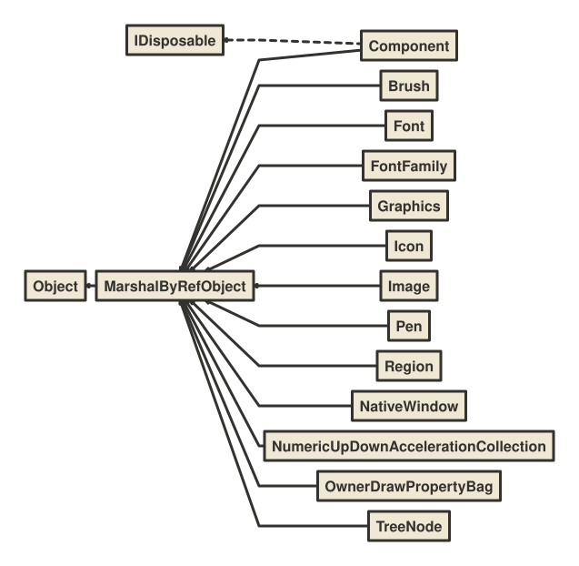
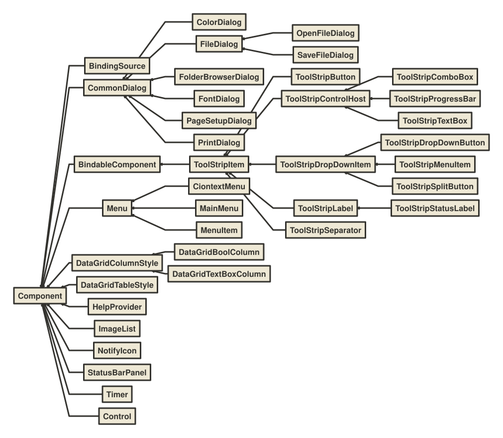
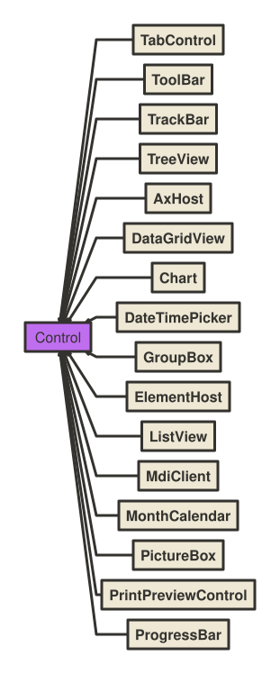
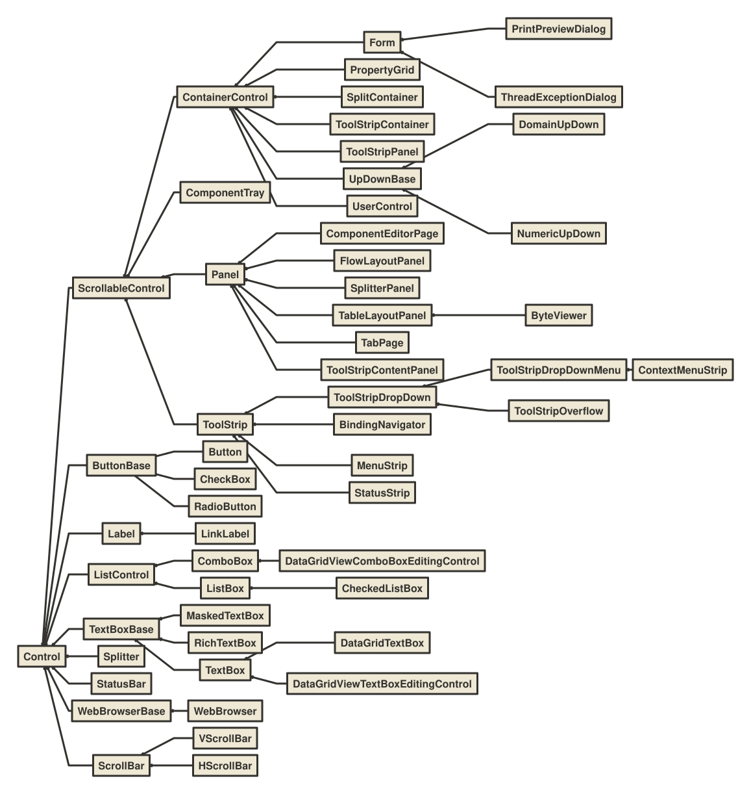

# Windows Froms

* **MarshalByRefObject**

    Enables access to objects across application domain boundaries in applications that support remoting.

* **Component**

    Provides the base implementation for the IComponent interface and enables object sharing between applications. Component is the base class for all components in the common language runtime that marshal by reference. Component is remotable and derives from the MarshalByRefObject class. Component provides an implementation of the IComponent interface. The MarshalByValueComponent provides an implementation of IComponent that marshals by value.

* **NativeWindow**

    Provides a low-level encapsulation of a window handle and a window procedure. This class automatically manages window class creation and registration. A window is not eligible for garbage collection when it is associated with a window handle. To ensure proper garbage collection, handles must either be destroyed manually using DestroyHandle or released using ReleaseHandle.

* **BindableComponent**

    Base class for components that provide properties that can be data bound with the Windows Forms Designer.

* **ToolStripItem**

    Represents the abstract base class that manages events and layout for all the elements that a ToolStrip or ToolStripDropDown can contain.

* **CommonDialog**

    Specifies the base class used for displaying dialog boxes on the screen. Inherited classes are required to implement RunDialog by invoking ShowDialog to create a specific common dialog box. Inherited classes can optionally override HookProc to implement specific dialog box hook functionality.

* **Control**

    Defines the base class for controls, which are components with visual representation. The Control class implements very basic functionality required by classes that display information to the user. It handles user input through the keyboard and pointing devices. It handles message routing and security. It defines the bounds of a control (its position and size), although it does not implement painting. It provides a window handle (hWnd).

* **AxHost**

    Wraps ActiveX controls and exposes them as fully featured Windows Forms controls.

* **MdiClient**

    Represents the container for multiple-document interface (MDI) child forms. This class cannot be inherited.

* **ElementHost**

    A Windows Forms control that can be used to host a Windows Presentation Foundation (WPF) element.

* **ScrollableControl**

    Defines a base class for controls that support auto-scrolling behavior. To enable a control to display scroll bars as needed, set the AutoScroll property to true and set the AutoScrollMinSize property to the desired size. When the control is sized smaller than the specified minimum size, or a child control is located outside the bounds of the control, the appropriate scroll bars are displayed.

* **ContainerControl**

    Provides focus-management functionality for controls that can function as a container for other controls. The container control can capture the TAB key press and move focus to the next control in the collection.

* **Panel**

    Used to group collections of controls. You can use a Panel to group collections of controls such as a group of RadioButton controls. As with other container controls such as the GroupBox control, if the Panel control's Enabled property is set to false, the controls contained within the Panel will also be disabled.

* **ThreadExceptionDialog**

    Implements a dialog box that is displayed when an unhandled exception occurs in a thread. **This API supports the product infrastructure and is not intended to be used directly from your code.**

* **UserControl**

    The UserControl gives you the ability to create controls that can be used in multiple places within an application or organization. You can include all the code needed for validation of common data you ask the user to input.

