:::parent

[toc maxlevel="2"] Contents

:::content


<hr class="pagebreak">

## Authors

* Ruzsinszki Gábor - https://www.linkedin.com/in/gabor-ruzsinszki-b564a8181/

## License

This work is licensed under a [Creative Commons Attribution-ShareAlike 4.0 International License](https://creativecommons.org/licenses/by-sa/4.0/).

The .NET Logo is copyright of the .NET authors. - https://github.com/dotnet/brand

 


The project is open-source and available on GitHub. You can contribute to it by visiting project's GitHub repository: https://github.com/webmaster442/ultimatedotnetcheatsheet


## Changelog

* 2024.02.29 - Initial release
* 2024.03.08 - Generic math interfaces extended & various small improvements
* 2024.09.28 - Grammar fixes, added cryptography and UI chapters

# Dotnet basic commands

* Check .NET version: `dotnet --version`
* List installed .NET SDKs: `dotnet --list-sdks`
* Show up-to-date status of installed .NET SDKs and .NET Runtimes: `dotnet sdk check`

## New

* Create new gitignore file in current dir: `dotnet new gitignore`
* Create new editorconfig file in current dir: `dotnet new editorconfig`
* Create new solution with name: `dotnet new  sln -n "Name of solution"`
* Create new class libary: `dotnet new classlib -n "Name of lib"`
* Create new console app: `dotnet new console -n "Program name"`
* Create new nunit test project: `dotnet new nunit -n "test project name"`
* Create new xunit test project: `dotnet new xunit -n "test project name"`

## Solution management

* List projects in solution: `dotnet sln [solution.sln] list `
* Add project to solution: `dotnet sln [solution.sln] add [project.csproj]`
* Remove project from solution: `dotnet sln [solution.sln] remove [project.csproj]`  

Note: solution file name can be ignored if folder only contains one `.sln` file.

## Package management

* List package references for project: `dotnet list [project.csproj] package`
* List package references for solution: `dotnet list [solution.sln] package`
* Add or update a package reference: `dotnet add [project.csproj] package [packagename]`
* Remove a package reference: `dotnet remove [project.csproj] package [packagename]`
* Restore package dependencies of project: `dotnet restore [project.csproj]`
* Restore package dependencies of solution: `dotnet restore [solution.sln]`
* Pack current project to nuget package: `dotnet pack [project.csproj]`

## Build & Run

* Build solution in debug mode: `dotnet build [solution.sln] -c DEBUG`
* Build solution in release mode: `dotnet build [solution.sln]  -c RELEASE`
* Build project in debug mode: `dotnet build [project.csproj] -c DEBUG`
* Build project in release mode: `dotnet build [project.csproj]  -c RELEASE`
* Clean output of a project: `dotnet clean [project.csproj]`
* Clean output of a solution: `dotnet clean [solution.sln]`
* Run a compiled assembly: `dotnet run [assembly.dll]`
* Run tests: `dotnet test [testproject.csproj]` or `dotnet test [solution.sln]`

## Tool management

* Install a tool: `dotnet tool install [tool Name]`
* Install a tool globaly: `dotnet tool install -g [tool Name]`
* List installed tools: `dotnet tool list`
* List globaly installed tools: `dotnet tool list -g`
* Remove a tool: `dotnet tool uninstall [tool Name]`
* Remove a globaly installed tool: `dotnet tool uninstall -g [tool Name]`
* Update a tool: `dotnet tool update [tool Name]`
* Update a globaly installed tool: `dotnet tool update -g [tool Name]`

Globaly means that the tool is installed to the users profile, instead of the current project/solution.

## NuGet

* Display all cache directories: `dotnet nuget locals all --list`
* Clear all files from all local cache directories: `dotnet nuget locals all --clear`
* Push a package to the NuGet repository: `dotnet nuget push [package.nupkg] -k [api key]`
* Push a package to a custom NuGet feed: `dotnet nuget push [package.nupkg] -k [api key] -s [feed url]`
* Push all .nupkg files in the current directory to a local feed directory: `dotnet nuget push "*.nupkg" -s [feed directory]`
* List all configured NuGet sources: `dotnet nuget list source [source name]`
* Remove a NuGet source: `dotnet nuget remove source`
* Add a NuGet source: `dotnet nuget add source [url or local path] -n [source name]`
* Update a NuGet source: `dotnet nuget update source [source name]`

## Formating

* Create a new editorconfig file: `dotnet new editorconfig`
* Format all code in the solution or a project: `dotnet format [solution.sln or project.csproj]`
* Verify that all code is correctly formatted: `dotnet format --verify-no-changes`

## Workloads

* List all available workloads: `dotnet workload search`
* Install an optional workload: `dotnet workload install [workload id]`
* Uninstall a workload: `dotnet workload uninstall [workload id]`
* List installed workloads: `dotnet workload list`
* Repair workload installations: `dotnet workload repair`
* Update installed workloads: `dotnet workload update`
* Install workload needed for a project or a solution: `dotnet workload restore [soluton.sln or project.csproj]`

## Tools

* Install a tool: `dotnet tool install --global [tool name]`
* Uninstall a tool: `dotnet tool uninstall --global [tool name]`
* Lists all tools that are currently installed: `dotnet tool list --global`
* Searches all .NET tools that are published to NuGet: `dotnet tool search [tool name]`

Global tools are installed in `$HOME/.dotnet/tools` on Linux and macOS. On Windows they are installed in the `%USERPROFILE%\.dotnet\tools` folder. Instead of the `--global` switch use the `--tool-path [folder]` to install the tool to a custom directory. If no `--global` or `--tool-path` is specified, then the tool is installed to the current C# project.

## Useful tools

* **dotnet-ef**

	The command-line interface (CLI) tools for Entity Framework Core perform design-time development tasks. For example, they create migrations, apply migrations, and generate code for a model based on an existing database. The commands are an extension to the cross-platform dotnet command, which is part of the .NET Core SDK. These tools work with .NET Core projects. 
    
    Install with: `dotnet tool install --global dotnet-ef`

    More info: https://learn.microsoft.com/en-us/ef/core/cli/dotnet

* **csharprepl**

    A cross-platform command line REPL for the rapid experimentation and exploration of C#. It supports IntelliSense, installing NuGet packages, and referencing local .NET projects and assemblies. 
    
    Install with: `dotnet tool install -g csharprepl`

    More info: https://github.com/waf/CSharpRepl
	
* **IronPython**

	IronPython is an open-source implementation of the Python programming language that is tightly integrated with .NET. IronPython can use .NET and Python libraries, and other .NET languages can use Python code just as easily.
    
    Install with: `dotnet tool install -g IronPython.Console`

    More info: https://ironpython.net/

* **dotnet-format**

    Dotnet-format is a code formatter for dotnet that applies style preferences to a project or solution. Preferences will be read from an .editorconfig file, if present, otherwise a default set of preferences will be used.
    
    Install with: `dotnet tool install -g dotnet-format`

    More info: https://github.com/dotnet/format

* **.NET Upgrade Assistant**
  
	The .NET Upgrade Assistant is a Visual Studio extension and command-line tool that's designed to assist with upgrading apps to the latest version of .NET.
    
    Install with: `dotnet tool install -g upgrade-assistant`

    More info: https://dotnet.microsoft.com/en-us/platform/upgrade-assistant

* **SlnGen**

    SlnGen is a Visual Studio solution file generator. Visual Studio solutions generally do not scale well for large project trees. They are scoped views of a set of projects. Enterprise-level builds use custom logic like traversal to convey how they should be built by a hosted build environment. Maintaining Visual Studio solutions becomes hard because you have to keep them in sync with the other build logic. Instead, SlnGen reads the project references of a given project to create a Visual Studio solution on demand. For example, you can run it against a unit test project and be presented with a Visual Studio solution containing the unit test project and all of its project references.

    Install with: `dotnet tool install --global Microsoft.VisualStudio.SlnGen.Tool --add-source https://api.nuget.org/v3/index.json --ignore-failed-sources`

    More info: https://github.com/microsoft/slngen

* **Roslynator Cli**

    Roslynator is a set of code analysis tools for C#, powered by Roslyn.

    Install with: `dotnet tool install -g roslynator.dotnet.cli`

    More info: https://josefpihrt.github.io/docs/roslynator/cli

# Project file XML settings

* Enable implicit usings:

    ```xml
    <PropertyGroup>
        <ImplicitUsings>enable</ImplicitUsings>
    </PropertyGroup>
    ```

* Enable nullable reference types
    
    ```xml
    <PropertyGroup>
        <Nullable>enable</Nullable>
    </PropertyGroup>
    ```
* Set internals visible to an other project

    ```xml
	<ItemGroup>
		<InternalsVisibleTo Include="ProjectName"/>
	</ItemGroup>
    ```
* Do not append target framework to output path

    ```xml
    <PropertyGroup>
        <AppendTargetFrameworkToOutputPath>false</AppendTargetFrameworkToOutputPath>
    </PropertyGroup>
    ```
* Set Assembly version based on build date (year.month.date)

    ```xml
    <PropertyGroup>
        <Version>
            $([System.DateTime]::UtcNow.ToString("yyyy")).$([System.DateTime]::UtcNow.ToString("MM"))
            .$([System.DateTime]::UtcNow.ToString("dd")).0
        </Version>
        <AssemblyVersion>
            $([System.DateTime]::UtcNow.ToString("yyyy")).$([System.DateTime]::UtcNow.ToString("MM"))
            .$([System.DateTime]::UtcNow.ToString("dd")).0
            </AssemblyVersion>
        <FileVersion>
            $([System.DateTime]::UtcNow.ToString("yyyy")).$([System.DateTime]::UtcNow.ToString("MM"))
            .$([System.DateTime]::UtcNow.ToString("dd")).0
        </FileVersion>
    </PropertyGroup>
    ```

* Disable Source Link Source Revision including in Assembly info:

    ```xml
    <PropertyGroup>
      <IncludeSourceRevisionInInformationalVersion>false</IncludeSourceRevisionInInformationalVersion>
    </PropertyGroup>
    ```

# Basic type system

## Numerical types

|  Type   | bytes  |   Bits   |                    Minimum value                     |                   Maximum  Value                    |
| :-----: | :----: | :------: | :--------------------------------------------------: | :-------------------------------------------------: |
|  byte   |   1    |    8     |                          0                           |                         255                         |
|  sbyte  |   1    |    8     |                         -127                         |                         127                         |
|  short  |   2    |    16    |                       -32 768                        |                       32 767                        |
| ushort  |   2    |    16    |                          0                           |                       65 535                        |
|   int   |   4    |    32    |                    -2 147 483 648                    |                    2 147 483 647                    |
|  uint   |   4    |    32    |                          0                           |                    4 294 967 295                    |
|  long   |   8    |    64    |              -9 223 372 036 854 775 808              |              9 223 372 036 854 775 807              |
|  ulong  |   8    |    64    |                          0                           |             18 446 744 073 709 551 615              |
| Int128  |   16   |   128    | -170 141 183 460 469 231 731 687 303 715 884 105 728 | 170 141 183 460 469 231 731 687 303 715 884 105 727 |
| UInt128 |   16   |   128    |                          0                           | 340 282 366 920 938 463 463 374 607 431 768 211 455 |
|  nint   | 4 or 8 | 32 or 64 |          platform dependent signed integer           |          platform dependent signed integer          |
|  nuint  | 4 or 8 | 32 or 64 |         platform dependent unsigned integer          |         platform dependent unsigned integer         |
|  float  |   4    |    32    |             -3.4028235 x 10<sup>38</sup>             |             3.4028235 x 10<sup>38</sup>             |
| double  |   8    |    64    |        -1.7976931348623157 x 10<sup>308</sup>        |        1.7976931348623157 x 10<sup>308</sup>        |
| decimal |   16   |   128    |               -7.92 x 10 <sup>28</sup>               |               7.92 x 10 <sup>28</sup>               |
|  Half   |   2    |    16    |                       -65 504                        |                       65 504                        |

Note: `nint` and `nuint` represent the platforms native integer type. For 32 bit systems this will be a 32 bit integer, so the limitations and properties of `int`
 or `uint` aplies. On 64 bit systems the limitations and properties of `long` and `ulong` applies.

**Smallest representable number in floating types, that is not zero:**

* `decimal`: 1.0 x 10<sup>-28</sup>
* `double` : 5.0 x 10<sup>-324</sup>
* `float` : 1.0 x 10<sup>-45</sup>
* `Half`: 6.0 x 10<sup>-8</sup>

## Numerical types provided by .NET

* **System.Numerics.BigInteger** : Represents an arbitrarily large signed integer.
* **System.Numerics.Complex** : Represents a complex number.
* **System.Numerics.Matrix3x2** : Represents a 3x2 matrix.
* **System.Numerics.Matrix4x4** : Represents a 4x4 matrix.
* **System.Numerics.Plane** : Represents a plane in three-dimensional space.
* **System.Numerics.Quaternion** : Represents a vector that is used to encode three-dimensional physical rotations.
* **System.Numerics.Vector2** : Represents a vector with two single-precision floating-point values.
* **System.Numerics.Vector3** : Represents a vector with three single-precision floating-point values.
* **System.Numerics.Vector4** : Represents a vector with four single-precision floating-point values.

## Generic Math Interfaces

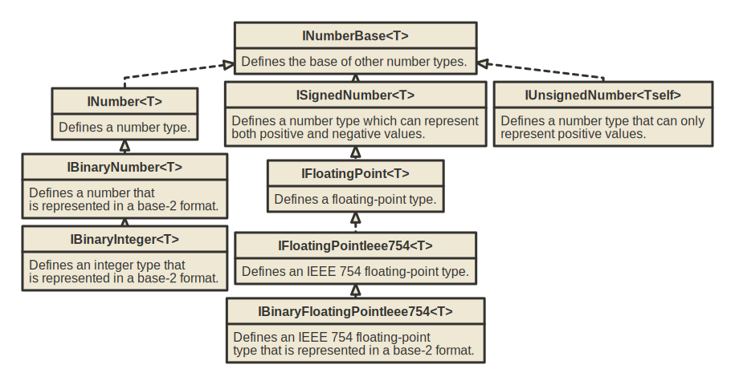

* `IComparable<T>` 

    Defines a generalized comparison method that a value type or class implements to create a type-specific comparison method for ordering or sorting its instances.

* `IConvertible`

    Defines methods that convert the value of the implementing reference or value type to a common language runtime type that has an equivalent value.

* `IEquatable<T>`

    Defines a generalized method that a value type or class implements to create a type-specific method for determining equality of instances.

* `IParsable<T>`

    Defines a mechanism for parsing a string to a value.

* `ISpanParsable<T>`

    Defines a mechanism for parsing a span of characters to a value.

* `IAdditionOperators<TSelf,TSelf,TSelf>`

    Defines a mechanism for computing the sum of two values. Provides operators: `+`

* `IBitwiseOperators<TSelf,TSelf,TSelf>`

    Defines a mechanism for performing bitwise operations over two values. Provides operators: `&`, `|`, `^`, `~`

* `IComparisonOperators<TSelf,TSelf,bool>`

    Defines a mechanism for comparing two values to determine relative order. Provides operators: `>`, `>=`, `<`, `<=` 

* `IDecrementOperators<T>`

    Defines a mechanism for decrementing a given value. Provides operators: `--`

* `IDivisionOperators<TSelf,TSelf,TSelf>`

    Defines a mechanism for computing the quotient of two values. Provides operators: `/`

* `IEqualityOperators<TSelf,TSelf,bool>`

    Defines a mechanism for comparing two values to determine equality. Provides operators: `==`, `!=`

* `IIncrementOperators<T>`

    Defines a mechanism for incrementing a given value. Provides operators: `++`

* `IModulusOperators<TSelf,TSelf,TSelf>`

    Defines a mechanism for computing the modulus or remainder of two values. Provides operators: `%`

* `IMultiplyOperators<TSelf,TSelf,TSelf>`

    Defines a mechanism for computing the product of two values. Provides operators: `*`

* `IShiftOperators<TSelf,int,TSelf>`

    Defines a mechanism for shifting a value by another value. Provides operators: `<<`, `>>`, `<<<`

* `ISubtractionOperators<TSelf,TSelf,TSelf>`

    Defines a mechanism for computing the difference of two values. Provides operators: `-`

* `IUnaryNegationOperators<TSelf,TSelf>`

    Defines a mechanism for computing the unary negation of a value. Provides operators: `-`

* `IUnaryPlusOperators<TSelf,TSelf>`

    Defines a mechanism for computing the unary plus of a value. Provides operators: `+`

* `IAdditiveIdentity<TSelf,TSelf>`

    Defines a mechanism for getting the additive identity of a given type.

* `IMultiplicativeIdentity<TSelf,TSelf>`

    Defines a mechanism for getting the multiplicative identity of a given type.

* `IMinMaxValue<T>`

    Defines a mechanism for getting the minimum and maximum value of a type.

* `IExponentialFunctions<T>`

    Defines support for exponential functions.

* `IFloatingPointConstants<T>`

    Defines support for floating-point constants, like `E`, `Pi`, `Tau`

* `IHyperbolicFunctions<T>`

    Defines support for hyperbolic functions.

* `ILogarithmicFunctions<T>`

    Defines support for logarithmic functions.

* `IPowerFunctions<T>`

    Defines support for power functions.

* `IRootFunctions<T>`

    Defines support for root functions.

* `ITrigonometricFunctions<T>`

    Defines support for trigonometric functions.

|             Interfaces / Types             | SByte, Int16, Int32, Int64 | Int128 | Byte, UInt16, UInt32, UInt64 | UInt128 | Half  | Single, Double | Decimal | Complex | BigInteger |
| :----------------------------------------: | :------------------------: | :----: | :--------------------------: | :-----: | :---: | :------------: | :-----: | :-----: | :--------: |
|              `INumberBase<T>`              |             √              |   √    |              √               |    √    |   √   |       √        |    √    |    √    |     √      |
|                `INumber<T>`                |             √              |   √    |              √               |    √    |   √   |       √        |    √    |         |     √      |
|             `ISignedNumber<T>`             |             √              |   √    |                              |         |   √   |       √        |    √    |    √    |     √      |
|          `IUnsignedNumber<Tself>`          |                            |        |              √               |    √    |       |                |         |         |            |
|             `IBinaryNumber<T>`             |             √              |   √    |              √               |    √    |   √   |       √        |         |         |     √      |
|            `IBinaryInteger<T>`             |             √              |   √    |              √               |    √    |       |                |         |         |     √      |
|            `IFloatingPoint<T>`             |                            |        |                              |         |   √   |       √        |    √    |         |            |
|         `IFloatingPointIeee754<T>`         |                            |        |                              |         |   √   |       √        |         |         |            |
|      `IBinaryFloatingPointIeee754<T>`      |                            |        |                              |         |   √   |       √        |         |         |            |
|              `IComparable<T>`              |             √              |   √    |              √               |    √    |   √   |       √        |    √    |         |     √      |
|               `IConvertible`               |             √              |        |              √               |         |       |       √        |    √    |         |            |
|              `IEquatable<T>`               |             √              |   √    |              √               |    √    |   √   |       √        |    √    |    √    |     √      |
|               `IParsable<T>`               |             √              |   √    |              √               |    √    |   √   |       √        |    √    |    √    |     √      |
|             `ISpanParsable<T>`             |             √              |   √    |              √               |    √    |   √   |       √        |    √    |    √    |     √      |
|  `IAdditionOperators<TSelf,TSelf,TSelf>`   |             √              |   √    |              √               |    √    |   √   |       √        |    √    |    √    |     √      |
|   `IBitwiseOperators<TSelf,TSelf,TSelf>`   |             √              |   √    |              √               |    √    |   √   |       √        |         |         |     √      |
|  `IComparisonOperators<TSelf,TSelf,bool>`  |             √              |   √    |              √               |    √    |   √   |       √        |    √    |         |     √      |
|          `IDecrementOperators<T>`          |             √              |   √    |              √               |    √    |   √   |       √        |    √    |    √    |     √      |
|  `IDivisionOperators<TSelf,TSelf,TSelf>`   |             √              |   √    |              √               |    √    |   √   |       √        |    √    |    √    |     √      |
|   `IEqualityOperators<TSelf,TSelf,bool>`   |             √              |   √    |              √               |    √    |   √   |       √        |    √    |    √    |     √      |
|          `IIncrementOperators<T>`          |             √              |   √    |              √               |    √    |   √   |       √        |    √    |    √    |     √      |
|   `IModulusOperators<TSelf,TSelf,TSelf>`   |             √              |   √    |              √               |    √    |   √   |       √        |    √    |         |     √      |
|  `IMultiplyOperators<TSelf,TSelf,TSelf>`   |             √              |   √    |              √               |    √    |   √   |       √        |    √    |    √    |     √      |
|     `IShiftOperators<TSelf,int,TSelf>`     |             √              |   √    |              √               |    √    |       |                |         |         |     √      |
| `ISubtractionOperators<TSelf,TSelf,TSelf>` |             √              |   √    |              √               |    √    |   √   |       √        |    √    |    √    |     √      |
|   `IUnaryNegationOperators<TSelf,TSelf>`   |             √              |   √    |              √               |    √    |   √   |       √        |    √    |    √    |     √      |
|     `IUnaryPlusOperators<TSelf,TSelf>`     |             √              |   √    |              √               |    √    |   √   |       √        |    √    |    √    |     √      |
|      `IAdditiveIdentity<TSelf,TSelf>`      |             √              |   √    |              √               |    √    |   √   |       √        |    √    |    √    |     √      |
|   `IMultiplicativeIdentity<TSelf,TSelf>`   |             √              |   √    |              √               |    √    |   √   |       √        |    √    |    √    |     √      |
|             `IMinMaxValue<T>`              |             √              |   √    |              √               |    √    |   √   |       √        |    √    |         |            |
|         `IExponentialFunctions<T>`         |                            |        |                              |         |   √   |       √        |         |         |            |
|        `IFloatingPointConstants<T>`        |                            |        |                              |         |   √   |       √        |    √    |         |            |
|         `IHyperbolicFunctions<T>`          |                            |        |                              |         |   √   |       √        |         |         |            |
|         `ILogarithmicFunctions<T>`         |                            |        |                              |         |   √   |       √        |         |         |            |
|            `IPowerFunctions<T>`            |                            |        |                              |         |   √   |       √        |         |         |            |
|            `IRootFunctions<T>`             |                            |        |                              |         |   √   |       √        |         |         |            |
|        `ITrigonometricFunctions<T>`        |                            |        |                              |         |   √   |       √        |         |         |            |

# Important interfaces for types

## IComparable\<T\>

Defines a generalized comparison method that a value type or class implements to create a type-specific comparison method for ordering or sorting its instances.

```csharp
interface IComparable<T>
{
	int CompareTo (T? other);
}
```

The CompareTo returns a value that indicates the relative order of the objects being compared. The return value has these meanings:

| Value | Meaning |
| :--| :-- |
| Less than zero | This instance precedes other in the `sort` order. |
| Zero | This instance occurs in the same position in the `sort` order as other. |
| Greater than zero | This instance follows other in the sort order. |

## IComparer\<T\>

Defines a method that a type implements to compare two objects.

This interface is used with the `List<T>.Sort` and `List<T>.BinarySearch` methods. It provides a way to customize the sort order of a collection. Classes that implement this interface include the `SortedDictionary<TKey,TValue>` and `SortedList<TKey,TValue>` generic classes.

The default implementation of this interface is the `Comparer<T>` class. The `StringComparer` class implements this interface for type String.

```csharp
interface IComparer<T>
{
	int Compare (T? x, T? y);
}
```

Return a signed integer that indicates the relative values of x and y, as shown in the following table:

| Value | Meaning |
| :--| :-- |
| Less than zero |`x` is less than `y`. |
| Zero | `x` equals `y`. |
| Greater than zero | `x` is greater than `y`. |

## IEquatable\<T\>

Defines a generalized method that a value type or class implements to create a type-specific method for determining equality of instances.

```csharp
interface IEquatable<T>
{
	bool Equals (T? other);
}
```

Note: If a type implements the `IEquatable<T>`, then the type must override the `Equals(object? other)` and `GetHashCode()` methods provided also.

## EqualityComparer\<T\>

Defines methods to support the comparison of objects for equality. This interface allows the implementation of customized equality comparison for collections. That is, you can create your own definition of equality for type `T`, and specify that this definition be used with a collection type that accepts the `IEqualityComparer<T>` generic interface.

```csharp
interface IEqualityComparer<T>
{
	bool Equals (T? x, T? y);
	int GetHashCode (T obj);
}
```

## IDisposable & IAsyncDisposable

The `IDisposable` interface is used to release unmanaged resources like file handles, database connections, network connections, or any resource that is not managed by the .NET runtime.

The `IDisposable` interface is typically implemented when a class holds onto resources that need to be explicitly released or closed to avoid potential resource leaks and do a proper cleanup. By implementing `IDisposable`, you can provide a mechanism for users of your class to explicitly release those resources when they're done with them, rather than relying on the garbage collector to eventually clean them up.

The `IAsyncDisposable` interface is similar to `IDisposable`, but it is specifically designed for asynchronous resource cleanup scenarios.

If you implement the `IAsyncDisposable` interface but not the `IDisposable` interface, your app can potentially leak resources. If a class implements `IAsyncDisposable`, but not `IDisposable`, and a consumer only calls `Dispose()`, your implementation would never call `DisposeAsync()`. This would result in a resource leak.

Implementation example:

```csharp
public class AsyncDisposable : IAsyncDisposable, IDisposable
{
    //a flag to indicate whether the object has been disposed to prevent multiple dispose calls
    private bool _disposed;

    //A disposable field
    private readonly MemoryStream _field;

    public AsyncDisposable()
    {
        _field = new MemoryStream();
    }

    //IDosposable implementation. Do not change this code. Put cleanup code in the Dispose(bool disposing) method
    public void Dispose()
    {
        Dispose(disposing: true);
        GC.SuppressFinalize(this);
    }

    //IAsyncDisposable implementation. Do not change this code. Put cleanup code in the DisposeAsyncCore method
    public async ValueTask DisposeAsync()
    {
        //Call the overridable DisposeAsyncCore that does the actual work
        await DisposeAsyncCore().ConfigureAwait(false);

        //no need to call finalizer, because the resources have been freed by the DisposeAsyncCore method
        GC.SuppressFinalize(this);
    }

    // Async version of Dispose method
    protected virtual async ValueTask DisposeAsyncCore()
    {
        if (!_disposed)
        {
            await _field.DisposeAsync().ConfigureAwait(false);
        }
    }

    // Sync version of Dispose method
    protected virtual void Dispose(bool disposing)
    {
        if (!_disposed)
        {
            if (disposing)
            {
                //Dispose managed state (managed objects)
                _field.Dispose();
            }

            // TODO: free unmanaged resources (unmanaged objects) and override finalizer
            // TODO: set large fields to null
            _disposed = true;
        }
    }

    //TODO: override finalizer only if 'Dispose(bool disposing)' has code to free unmanaged resources
    // ~AsyncDisposable()
    // {
    //     // Do not change this code. Put cleanup code in Dispose(bool disposing) method
    //     Dispose(disposing: false);
    // }
}
```

# Operator Precedence

1. Primary:

    `x.y`, `f(x)`, `a[i]`, `x?.y`, `x?[y]`, `x++`, `x--`, `x!`, `new`, `typeof`, `checked`, `unchecked`, `default`, `nameof`, `delegate`, `sizeof`, `stackalloc`, `x->y`
2. Unary: `+x, -x, !x, ~x, ++x, --x, ^x, (T)x, await, &x, *x, true and false`
3. Range: `x..y`
4. Switch and with expressions: `switch, with`
5. Multiplicative: `x * y, x / y, x % y`
6. Additive: `x + y`, `x – y`
7. Shift: `x << y`, `x >> y`, `x >>> y`
8. Relational and type-testing: `x < y`, `x > y`, `x <= y`, `x >= y`, `is`, `as`
9. Equality: `x == y`, `x != y`
10. Boolean logical AND or bitwise logical AND: x & y`
11. Boolean logical XOR or bitwise logical XOR: `x ^ y`
12. Boolean logical OR or bitwise logical OR: `x | y`
13. Conditional AND: `x && y`
14. Conditional OR: `x || y`
15. Null-coalescing operator: `x ?? y`
16. Conditional operator: `c ? t : f`
17. Assignment and lambda declaration: 

    `x = y`, `x += y`, `x -= y`, `x *= y`, `x /= y`, `x %= y`, `x &= y`, `x |= y`, `x ^= y`, `x <<= y`, `x >>= y`, `x >>>= y`, `x ??= y`, `=>`

More info: https://learn.microsoft.com/en-us/dotnet/csharp/language-reference/operators/

# Access modifiers

|           Caller's location            | `public` | `protected  internal` | `protected` | `internal` | `private protected` | `private` |
| :------------------------------------: | :------: | :-------------------: | :---------: | :--------: | :-----------------: | :-------: |
|            Within the class            |    √     |           √           |      √      |     √      |          √          |     √     |
|     Derived class (same assembly)      |    √     |           √           |      √      |     √      |          √          |     X     |
|   Non-derived class (same assembly)    |    √     |           √           |      X      |     √      |          X          |     X     |
|   Derived class (different assembly)   |    √     |           √           |      √      |     X      |          X          |     X     |
| Non-derived class (different assembly) |    √     |           X           |      X      |     X      |          X          |     X     |


More info: https://learn.microsoft.com/en-us/dotnet/csharp/programming-guide/classes-and-structs/access-modifiers

# Strings

More infos:

* https://learn.microsoft.com/en-us/dotnet/csharp/programming-guide/strings/
* https://learn.microsoft.com/en-us/dotnet/standard/base-types/standard-numeric-format-strings


## String escape sequences

| Escape sequence |                           Character name                            |
| :-------------: | :-----------------------------------------------------------------: |
|      `\'`       |                            Single quote                             |
|       `\`       |                            Double quote                             |
|      `\\`       |                              Backslash                              |
|      `\0`       |                                Null                                 |
|      `\a`       |                                Alert                                |
|      `\b`       |                              Backspace                              |
|      `\f`       |                              Form feed                              |
|      `\n`       |                              New line                               |
|      `\r`       |                           Carriage return                           |
|      `\t`       |                           Horizontal tab                            |
|      `\v`       |                            Vertical tab                             |
|      `\u`       |      Unicode escape sequence (UTF-16) followed by 4 hex digits      |
|      `\U`       |      Unicode escape sequence (UTF-32) followed by 8 hex digits      |
|      `\x`       | Unicode escape sequence similar to "\u" except with variable length |


## Numeric format strings

| Format specifier |    Name     |         Supported          |                                             Description                                             |
| :--------------: | :---------: | :------------------------: | :-------------------------------------------------------------------------------------------------: |
|    `C` or `c`    |  Currency   |     All numeric types      |                                      Formats value as currency                                      |
|    `D` or `d`    |   Decimal   |       Integral types       |                             Integer digits with optional negative sign.                             |
|    `E` or `e`    | Exponential |     All numeric types      |                                        Exponential notation                                         |
|    `F` or `f`    | Fixed-point |     All numeric types      |                      Integral and decimal digits with optional negative sign.                       |
|   `G` or  `g`    |   General   |     All numeric types      |                   The more compact of either fixed-point or scientific notation.                    |
|    `N` or `n`    |   Number    |     All numeric types      | Integral and decimal digits, group separators, and a decimal separator with optional negative sign. |
|    `P` or `p`    |   Percent   |     All numeric types      |                    Number multiplied by 100 and displayed with a percent symbol.                    |
|    `R` or `r`    | Round-trip  | Single, Double, BigInteger |                        A string that can round-trip to an identical number.                         |
|    `X` or `x`    | Hexadecimal |       Integral types       |                                        A hexadecimal string.                                        |
|    any other     |   Unknown   |     All numeric types      |                               Throws a `FormatException` at run time.                               |

## Custom numeric format strings

| Format specifier |                     Name                     |                                                        Description                                                        |
| :--------------: | :------------------------------------------: | :-----------------------------------------------------------------------------------------------------------------------: |
|       `0`        |               Zero placeholder               |      Replaces the zero with the corresponding digit if one is present; otherwise, zero appears in the result string.      |
|       `#`        |              Digit placeholder               | Replaces the "#" symbol with the corresponding digit if one is present; otherwise, no digit appears in the result string. |
|       `.`        |                Decimal point                 |                          Determines the location of the decimal separator in the result string.                           |
|       `,`        | Group separator, number scaling <sup>I</sup> |                             Serves as both a group separator and a number scaling specifier.                              |
|       `%`        |            Percentage placeholder            |                Multiplies a number by 100 and inserts a localized percentage symbol in the result string.                 |
|       `‰`        |            Per mille placeholder             |                Multiplies a number by 1000 and inserts a localized per mille symbol in the result string.                 |
|       `E0`       |      Exponential notation <sup>II</sup>      |                   If followed by at least one 0 (zero), formats the result using exponential notation.                    |
|       `\`        |       Escape character <sup>III</sup>        |            Causes the next character to be interpreted as a literal rather than as a custom format specifier.             |
|       `;`        |       Section separator <sup>IV</sup>        |                  Defines sections with separate format strings for positive, negative, and zero numbers.                  |
|    any other     |             All other characters             |                                  The character is copied to the result string unchanged.                                  |


**I**: . As a group separator, it inserts a localized group separator character between each group. As a number scaling specifier, it divides a number
 by 1000 for each comma specified.

**II**: The case of "E" or "e" indicates the case of the exponent symbol in the result string. The number of zeros following the "E" or "e" character determines
 the minimum number of digits in the exponent. A plus sign (+) indicates that a sign character always precedes the exponent. 
 A minus sign (-) indicates that a sign character precedes only negative exponents.

**III**: The `#`, `0`, `.`, `,`, `%`, and `‰` symbols in a format string are interpreted as format specifiers rather than as literal characters. 
Depending on their position in a custom format string, the uppercase and lowercase "E" as well as the + and - symbols may also be interpreted as format specifiers.

**IV**: The semicolon (;) is a conditional format specifier that applies different formatting to a number depending on whether its value is positive, negative, or zero. 
To produce this behaviour, a custom format string can contain up to three sections separated by semicolons. These sections are:

* One section:
  The format string applies to all values.

* Two sections:
  The first section applies to positive values and zeros, and the second section applies to negative values.

  If the number to be formatted is negative, but becomes zero after rounding according to the format in the second section,
  the resulting zero is formatted according to the first section.

* Three sections:
  The first section applies to positive values, the second section applies to negative values, and the third section applies to zeros.

  The second section can be left empty (by having nothing between the semicolons), in which case the first section applies to all non-zero values.

  If the number to be formatted is non-zero, but becomes zero after rounding according to the format in the first or second section,
  the resulting zero is formatted according to the third section.

## Standard date and time format strings

| Format specifier |              Description              |      Example (en-Us culture)      |
| :--------------: | :-----------------------------------: | :-------------------------------: |
|       `d`        |          Short date pattern           |             6/15/2009             |
|       `D`        |           Long date pattern           |       Monday, June 15, 2009       |
|       `f`        |  Full date/time pattern (short time)  |   Monday, June 15, 2009 1:45 PM   |
|       `F`        |  Full date/time pattern (long time)   | Monday, June 15, 2009 1:45:30 PM  |
|       `g`        | General date/time pattern (long time) |       6/15/2009 1:45:30 PM        |
|    `m` or `M`    |           Month/day pattern           |              June 15              |
|    `O` or `o`    |     Round-trip date/time pattern      | 2009-06-15T13:45:30.0000000-07:00 |
|    `R` or `r`    |            RFC1123 pattern            |     Mon, 15 Jun 2009 20:45:30     |
|       `s`        |      Sortable date/time pattern       |        2009-06-15T13:45:30        |
|       `t`        |          Short time pattern           |              1:45 PM              |
|       `T`        |           Long time pattern           |            1:45:30 PM             |
|       `u`        | Universal sortable date/time pattern  |       2009-06-15 13:45:30Z        |
|       `U`        |   Universal full date/time pattern    | Monday, June 15, 2009 8:45:30 PM  |
|    `Y` or `y`    |          Year month pattern           |             June 2009             |

## Custom date and time format strings

| Format specifier |                             Description                             |
| :--------------: | :-----------------------------------------------------------------: |
|       `d`        |              The day of the month, from 1 through 31.               |
|       `dd`       |              The day of the month, from 01 through 31               |
|      `ddd`       |             The abbreviated name of the day of the week             |
|      `dddd`      |                The full name of the day of the week                 |
|   `g` or `gg`    |                          The period or era                          |
|       `h`        |            The hour, using a 12-hour clock from 1 to 12             |
|       `hh`       |            The hour, using a 12-hour clock from 01 to 12            |
|       `H`        |            The hour, using a 24-hour clock from 0 to 23             |
|       `HH`       |            The hour, using a 24-hour clock from 00 to 23            |
|       `K`        |                        Time zone information                        |
|       `m`        |                    The minute, from 0 through 59                    |
|       `mm`       |                   The minute, from 00 through 59                    |
|       `M`        |                    The month, from 1 through 12                     |
|       `MM`       |                    The month, from 01 through 12                    |
|      `MMM`       |                  The abbreviated name of the month                  |
|      `MMMM`      |                     The full name of the month                      |
|       `s`        |                    The second, from 0 through 59                    |
|       `ss`       |                   The second, from 00 through 59                    |
|       `t`        |             The first character of the AM/PM designator             |
|       `tt`       |                        The AM/PM designator                         |
|       `y`        |                       The year, from 0 to 99                        |
|       `yy`       |                       The year, from 00 to 99                       |
|      `yyy`       |              The year, with a minimum of three digits               |
|      `yyyy`      |                   The year as a four-digit number                   |
|     `yyyyy`      |                   The year as a five-digit number                   |
|       `z`        |            Hours offset from UTC, with no leading zeros             |
|       `zz`       | Hours offset from UTC, with a leading zero for a single-digit value |
|      `zzz`       |                  Hours and minutes offset from UTC                  |
|       `:`        |                         The time separator                          |
|       `/`        |                         The date separator                          |
|       `\`        |                        The escape character                         |

# Common exceptions

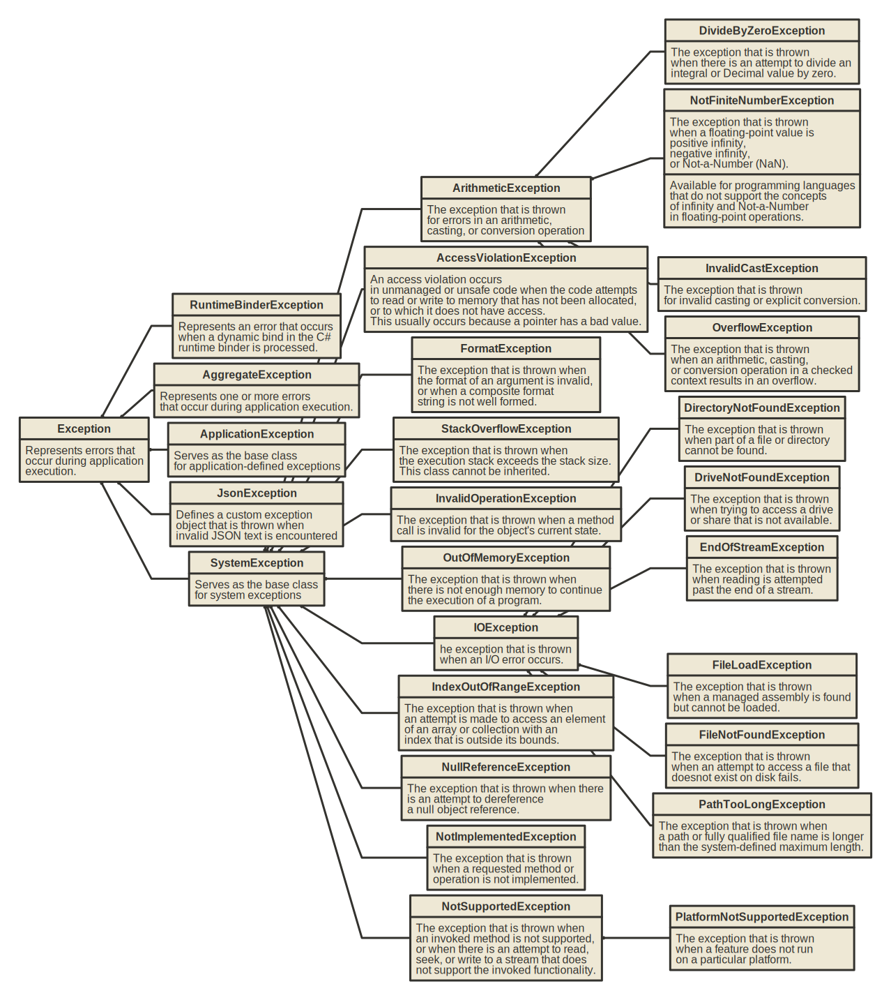

# Collections


|                 Type                 |                                Description                                |                                Is                                |
| :----------------------------------: | :-----------------------------------------------------------------------: | :--------------------------------------------------------------: |
|                `T[]`                 |                            Represents an Array                            |                  `IList<T>`, `IReadonlyList<T>`                  |
|              `List<T>`               | Represents a strongly typed list of objects that can be accessed by index |                  `IList<T>`, `IReadonlyList<T>`                  |
|      `Dictionary<TKey, TValue>`      |                Represents a collection of keys and values                 | `IReadOnlyDictionary<TKey, TValue>`, `IDictionary<TKey, TValue>` |
|             `HashSet<T>`             |                        Represents a set of values                         |                   `ISet<T>`, `IReadOnlySet<T>`                   |
|              `Queue<T>`              |                Represents a first-in, first-out collection                |            `ICollection<T>`, `IReadOnlyCollection<T>`            |
| `PriorityQueue<TElement, TPriority>` |       On Dequeue the item with the lowest priority value is removed       |                                --                                |
|              `Stack<T>`              |      Represents a variable size last-in-first-out (LIFO) collection       |            `ICollection<T>`, `IReadOnlyCollection<T>`            |
|           `LinkedList<T>`            |                      Represents a doubly linked list                      |            `ICollection<T>`, `IReadOnlyCollection<T>`            |


## Concurrent Collections

|                Type                 |                               Description                               |                                Is                                 |
| :---------------------------------: | :---------------------------------------------------------------------: | :---------------------------------------------------------------: |
|       `BlockingCollection<T>`       | Provides blocking and bounding capabilities for thread-safe collections |                     `IReadOnlyCollection<T>`                      |
|         `ConcurrentBag<T>`          |        Represents a thread-safe, unordered collection of objects        |    `IReadOnlyCollection<T>`, `IProducerConsumerCollection<T>`     |
| `ConcurrentDictionary<TKey,TValue>` |         Represents a thread-safe collection of key/value pairs          | `IReadOnlyDictionary<TKey,TValue>`,  ` IDictionary<TKey,TValue> ` |
|        `ConcurrentQueue<T>`         |      Represents a thread-safe first in-first out (FIFO) collection      |    `IReadOnlyCollection<T>`, `IProducerConsumerCollection<T>`     |
|        `ConcurrentStack<T>`         |      Represents a thread-safe last in-first out (LIFO) collection       |    `IReadOnlyCollection<T>`, `IProducerConsumerCollection<T>`     |

# LINQ

## Filtering

```csharp
var customerOrders = Orders.Where(order => order.CustomerId == 66);
```

## Select with anonymus type

```csharp
var ordersWithCost = Orders.Select(order => new
{
    OrderId = order.Id,
    Cost = order.Cost,
});
```

## Ordering

```csharp
var ascendingOrder = orders.OrderBy(order => order.Cost);
var descendingOrder = orders.OrderByDescending(order => order.Cost);

var multipleOdering = orders.OrderBy(order => order.Cost).ThenBy(order => order.CustomerId);
```

## Join

```csharp
var joined = customers.Join(orders, 
                            customer => customer.Id, 
                            order => order.CustomerId
                            (customer, order) => new
                            {
                                CustomerId = customer.Id,
                                Name = customer.Name,
                                Cost = order.Cost, 
                            });
```

## Grouping

```csharp
var grouped = orders.GroupBy(order => CustomerId);
```

## Skip & Take

```csharp
var take3 = orders.Take(3);
var next3 = orders.Skip(3).Take(3);
```

## Element operations

```csharp
//throws exception if element not found
var firstCustomer = customers.First(customer => customer.Id == 63);
var lastCustomer = customers.Last(customer => customer.Id == 63);
//returns default value if element not found
var firstCustomer = customers.FirstOrDefault(customer => customer.Id == 63);
var lastCustomer = customers.LastOrDefault(customer => customer.Id == 63);
```

## Conversions

```csharp
Order[] orders = Orders.Where(order => order.CustomerId == 66).ToArray();
List<Order> orders = Orders.Where(order => order.CustomerId == 66).ToList();
HashSet<Order> orders = Orders.Where(order => order.CustomerId == 66).ToHashSet();
Dictionary<int, string> customerDictionary
     = Customers.ToDictionary(customer => customer.Id, customer => customer.Name);
```

# Pattern matching

## Discard pattern

The discard pattern can be used to match any expression, including `null`. It's represented by the `_` symbol.

```csharp
bool isFloatingPointNumber(string input)
{
    //the out value of the conversion is discarded
    return double.TryParse(input, out double _);
}
```

## var pattern

The `var` pattern can be used to match any expression, including `null`, and assign its result to a new local variable:

```csharp
bool isFloatingPointNumber(string input)
{
    return double.TryParse(input, out var _);
}
```

## Declaration and type patterns

```csharp
object greeting = "Hello, World!";
if (greeting is string message)
{
	//greeting is a string and casted to message variable
}
```

A declaration pattern with type T matches an expression when an expression result is non-null and any of the following conditions are true:

* The run-time type of an expression result is T.
* The run-time type of an expression result derives from type T, implements interface T, or another implicit reference conversion exists from it to T.

**Null checking:**

```csharp
if (input is not null)
{
    // ...
}
```

**Type checking in switch:**

```csharp
public abstract class Vehicle {}
public class Car : Vehicle {}
public class Truck : Vehicle {}

public static class TollCalculator
{
    public static decimal CalculateToll(this Vehicle vehicle) => vehicle switch
    {
        Car _ => 2.00m,
        Truck _ => 7.50m,
        null => throw new ArgumentNullException(nameof(vehicle)),
        _ => throw new ArgumentException("Unknown type of a vehicle", nameof(vehicle)),
    };
}
```

## Constant pattern

```csharp
public static decimal GetGroupTicketPrice(int visitorCount) => visitorCount switch
{
    1 => 12.0m,
    2 => 20.0m,
    3 => 27.0m,
    0 => 0.0m,
    _ => throw new ArgumentException($"Not supported number of visitors: {visitorCount}", nameof(visitorCount)),
};
```

In a constant pattern, you can use any constant expression, such as integers, floating-point numbers, char, string, boolean, enums, name of a declared const field or local and null. Note: `Span<char>` or `ReadOnlySpan<char>` can also be matched in the constant pattern, but in C# 11 and later versions

## Relational patterns

```csharp
static string Classify(double measurement) => measurement switch
{
    < -4.0 => "Too low",
    > 10.0 => "Too high",
    double.NaN => "Unknown",
    _ => "Acceptable",
};
```

In a relational pattern, you can use any of the relational operators `<`, `>`, `<=`, or `>=`. The right-hand part of a relational pattern must be a constant expression. For the constant expression, the constant pattern limitations apply.

## Logical patterns

```csharp
static string Classify(double measurement) => measurement switch
{
    < -40.0 => "Too low",
    >= -40.0 and < 0 => "Low",
    >= 0 and < 10.0 => "Acceptable",
    >= 10.0 and < 20.0 => "High",
    >= 20.0 => "Too high",
    double.NaN => "Unknown",
};
```

```csharp
static string GetCalendarSeason(DateTime date) => date.Month switch
{
    3 or 4 or 5 => "spring",
    6 or 7 or 8 => "summer",
    9 or 10 or 11 => "autumn",
    12 or 1 or 2 => "winter",
    _ => throw new ArgumentOutOfRangeException(nameof(date), $"Date with unexpected month: {date.Month}."),
};
```

Precedence: `not`, `and`, `or`. To explicitly specify the precedence, use parentheses:

```csharp
static bool IsLetter(char c) => c is (>= 'a' and <= 'z') or (>= 'A' and <= 'Z');
```

## Property Pattern

```csharp
static bool IsConferenceDay(DateTime date) => date is { Year: 2020, Month: 5, Day: 19 or 20 or 21 };
```

A property pattern matches an expression when an expression result is non-null and every nested pattern matches the corresponding property or field of the expression result. It can be combined with run-time type check and variable declaration:

```csharp
static string TakeFive(object input) => input switch
{
    string { Length: >= 5 } s => s.Substring(0, 5),
    string s => s,

    ICollection<char> { Count: >= 5 } symbols => new string(symbols.Take(5).ToArray()),
    ICollection<char> symbols => new string(symbols.ToArray()),

    null => throw new ArgumentNullException(nameof(input)),
    _ => throw new ArgumentException("Not supported input type."),
};
```

## Positional pattern

You use a positional pattern to deconstruct an expression result and match the resulting values against the corresponding nested patterns.

```csharp
public readonly struct Point
{
    public int X { get; }
    public int Y { get; }

    public Point(int x, int y) => (X, Y) = (x, y);
    public void Deconstruct(out int x, out int y) => (x, y) = (X, Y);
}

static string Classify(Point point) => point switch
{
    (0, 0) => "Origin",
    (1, 0) => "positive X basis end",
    (0, 1) => "positive Y basis end",
    _ => "Just a point",
};
```

At the preceding example, the type of an expression contains the Deconstruct method, which is used to deconstruct an expression result. You can also match expressions of tuple types against positional patterns. In that way, you can match multiple inputs against various patterns:

```csharp
static decimal GetGroupTicketPriceDiscount(int groupSize, DateTime visitDate)
    => (groupSize, visitDate.DayOfWeek) switch
    {
        (<= 0, _) => throw new ArgumentException("Group size must be positive."),
        (_, DayOfWeek.Saturday or DayOfWeek.Sunday) => 0.0m,
        (>= 5 and < 10, DayOfWeek.Monday) => 20.0m,
        (>= 10, DayOfWeek.Monday) => 30.0m,
        (>= 5 and < 10, _) => 12.0m,
        (>= 10, _) => 15.0m,
        _ => 0.0m,
    };
```

## List patterns

```csharp
int[] numbers = { 1, 2, 3 };

numbers is [1, 2, 3]; //true
numbers is [1, 2, 4]; //false
numbers is [1, 2, 3, 4]; //false
numbers is [0 or 1, <= 2, >= 3]; //true
```

To match elements only at the start or/and the end of an input sequence, use the slice pattern (`..`);  A slice pattern matches zero or more elements. You can use at most one slice pattern in a list pattern. The slice pattern can only appear in a list pattern.

```csharp
new[] { 1, 2, 3, 4, 5 } is [> 0, > 0, ..];  // True
new[] { 1, 1 } is [_, _, ..];  // True
new[] { 0, 1, 2, 3, 4 } is [> 0, > 0, ..];  // False
new[] { 1 } is [1, 2, ..];  // False

new[] { 1, 2, 3, 4 } is [.., > 0, > 0];  // True
new[] { 2, 4 } is [.., > 0, 2, 4];  // False
new[] { 2, 4 } is [.., 2, 4];  // True

new[] { 1, 2, 3, 4 } is [>= 0, .., 2 or 4];  // True
new[] { 1, 0, 0, 1 } is [1, 0, .., 0, 1];  // True
new[] { 1, 0, 1 } is [1, 0, .., 0, 1];  // False
```

# I/O

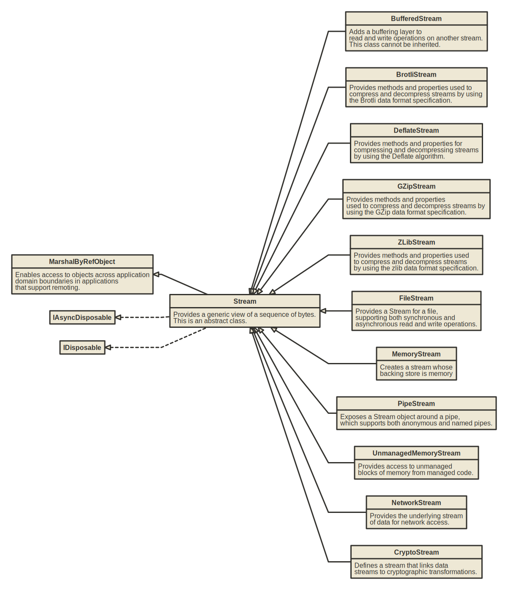

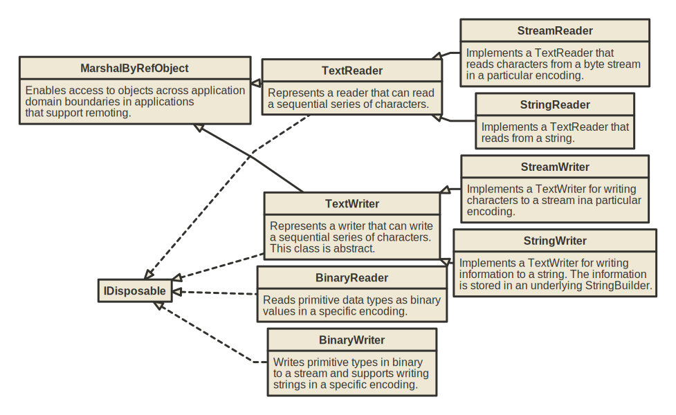

# Attributes

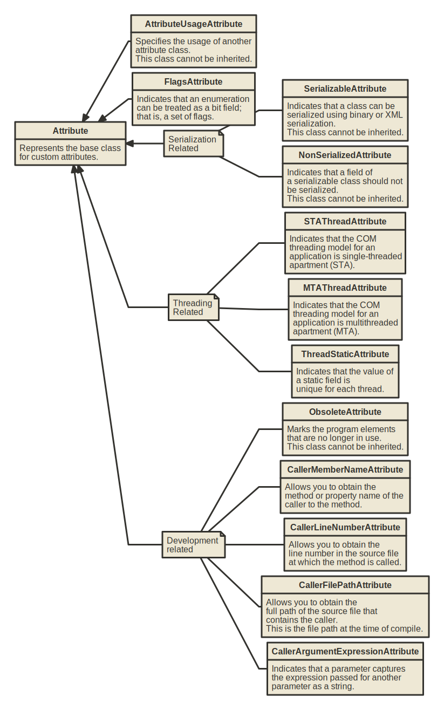

## Data annotation

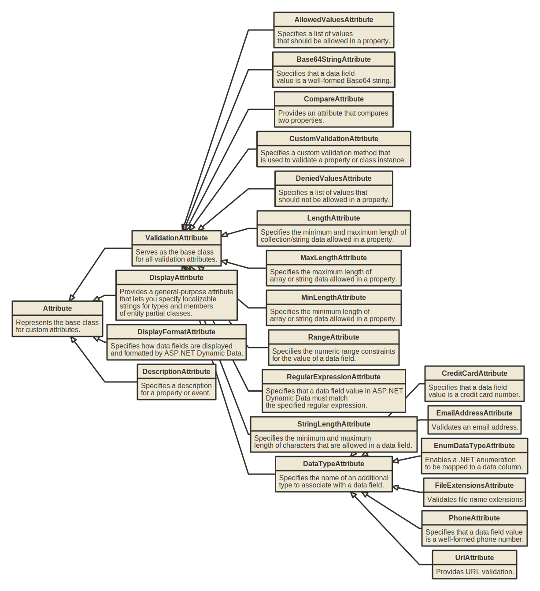


# Cryptography

## Encryption Algortithms


**Symmetric encryption**

Symmetric encryption is a cryptographic method where the same key is used for both encryption and decryption of data. In other words, the sender and the recipient use a shared secret key to encrypt and decrypt messages. It is commonly used in various applications, including securing data transmission over networks, encrypting files stored on disk, and protecting sensitive information in databases. 

**Asymmetric encryption**

Asymmetric encryption, also known as public-key cryptography, is a cryptographic method that uses two separate keys for encryption and decryption. A public, and a private key. The pair of keys are mathematically related, but distinct. It is widely used in various applications, including secure Communication, digital signatures and key exchange.

## Hash Algorithms


**Hash Algorithms**

A hash algorithm, also known as a cryptographic hash function, is a mathematical algorithm that takes an input (or "message") and produces a fixed-size string of bytes, which are typically represented as a hexadecimal number or it is base64 encoded.

Hash algorithms have several important properties: They are deterministic. For a given input, the hash algorithm always produces the same output and given a hash value, it should be computationally infeasible to determine the original input.

A cryptographic hash function is resilient to collision. It should be extremely unlikely for two different inputs to produce the same hash value. This property is crucial for ensuring the integrity of data. Even a small change in the input should result in a significantly different hash value.

Hash algorithms are widely used in cryptography for various purposes, including data integrity checks, digital signatures and password storage.

It's worth noting that while MD5 and SHA-1 were once widely used, they are now considered vulnerable to various attacks, and it's generally recommended to use stronger hash functions such as SHA-256 or SHA-3 for cryptographic purposes.

**HMAC**

Hash-based Message Authentication Code (HMAG), is a mechanism for generating a cryptographic hash of data in combination with a secret key. It provides a way to verify both the integrity and authenticity of a message.

HMAC takes two inputs - the message to be authenticated and a secret key known only to the sender and the receiver. It uses a cryptographic hash function (such as MD5, SHA-1, SHA-256) to process the message. The secret key is mixed with the message in a specific way, usually by XOR operations and padding, to create a unique digest. The mixed data is then hashed using the chosen hash function and the output of the hash function is the HMAC.

The recipient, who knows the secret key, can generate the HMAC using the received message and compare it to the transmitted HMAC. If they match, it indicates that the message has not been tampered with during transmission and that it was sent by someone with knowledge of the secret key.

# UI

* **Windows Forms**

    Windows Forms is a UI framework for building Windows desktop apps. It provides one of the most productive ways to create desktop apps based on the visual designer provided in Visual Studio. Functionality such as drag-and-drop placement of visual controls makes it easy to build desktop apps.

* **WPF**

    Windows Presentation Foundation (WPF) is a UI framework that is resolution-independent and uses a vector-based rendering engine, built to take advantage of modern graphics hardware. WPF provides a comprehensive set of application-development features that include Extensible Application Markup Language (XAML), controls, data binding, layout, 2D and 3D graphics, animation, styles, templates, documents, media, text, and typography. WPF is part of .NET, so you can build applications that incorporate other elements of the .NET API.

## MVVM

The MVVM pattern helps cleanly separate an application's business and presentation logic from its user interface (UI). Maintaining a clean separation between application logic and the UI helps address numerous development issues and makes an application easier to test, maintain, and evolve. It can also significantly improve code re-use opportunities and allows developers and UI designers to collaborate more easily when developing their respective parts of an app.
    
Frameworks:

* CommunityToolkit.Mvvm - https://learn.microsoft.com/en-us/dotnet/communitytoolkit/mvvm/
* ReactiveUI - https://www.reactiveui.net/
* Prism Libary - https://prismlibrary.com/

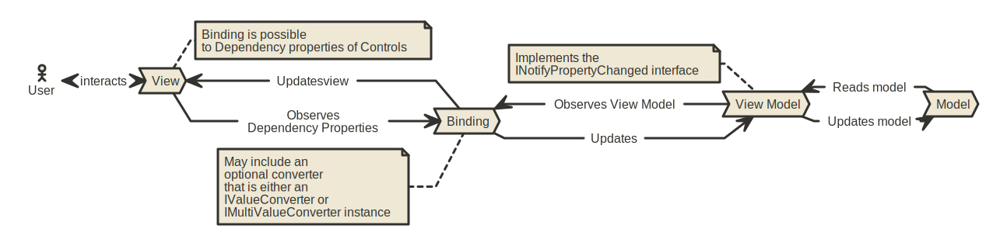

### Minimal MVVM Implementation

```csharp
public abstract class ViewModelBase : INotifyPropertyChanged
{
    public event PropertyChangedEventHandler? PropertyChanged;

    protected void OnPropertyChanged(string propertyName = "") 
        => PropertyChanged?.Invoke(this, new PropertyChangedEventArgs(propertyName));

    protected void SetValue<T>(ref T field,
                               T newValue,
                               [CallerMemberName] string properyName = "")
    {
        if (!EqualityComparer<T>.Default.Equals(field, newValue))
        {
            field = newValue;
            OnPropertyChanged(properyName);
        }
    }

    protected void SetValue<T>(ref T field,
                               T newValue,
                               IEqualityComparer<T> comparer,
                               [CallerMemberName] string properyName = "")
    {
        if (!comparer.Equals(field, newValue))
        {
            field = newValue;
            OnPropertyChanged(properyName);
        }
    }
}
```

```csharp
public class RelayCommand : ICommand
{
    private readonly Action<object?> _acton;
    private readonly Predicate<object?>? _canExecute;

    public event EventHandler? CanExecuteChanged;

    public RelayCommand(Action<object?> acton, Predicate<object?>? canExecute = null)
    {
        _acton = acton;
        _canExecute = canExecute;
    }

    public void RaiseCanExecuteChanged()
        => CanExecuteChanged?.Invoke(this, EventArgs.Empty);

    public bool CanExecute(object? parameter)
        => _canExecute == null || _canExecute(parameter);

    public void Execute(object? parameter)
        => _acton.Invoke(parameter);
}
```

## WPF class hierarchy

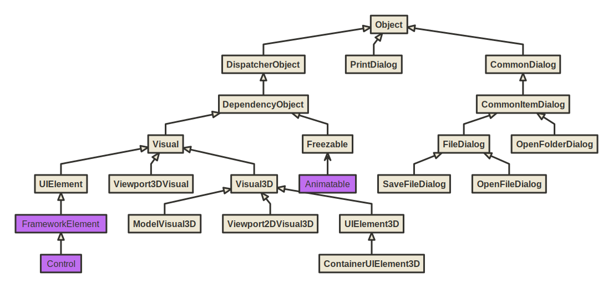

* **DispatcherObject**

	Represents an object that is associated with a Dispatcher. The Dispatcher Provides services for managing the queue of work items for a thread.
	
* **DependencyObject**

	Represents an object that participates in the dependency property system.
	
* **Visual**

	Provides rendering support in WPF, which includes hit testing, coordinate transformation, and bounding box calculations.
	
* **UIElement**

	UIElement is a base class for WPF core level implementations building on Windows Presentation Foundation (WPF) elements and basic presentation characteristics.
	
* **FrameworkElement**

	Provides a WPF framework-level set of properties, events, and methods for Windows Presentation Foundation (WPF) elements. This class represents the provided WPF framework-level implementation that is built on the WPF core-level APIs that are defined by UIElement.
	
* **Control**

	Represents the base class for user interface (UI) elements that use a ControlTemplate to define their appearance.

* **Freezable**

	Defines an object that has a modifiable state and a read-only (frozen) state. Classes that derive from Freezable provide detailed change notification, can be made immutable, and can clone themselves.

* **Animatable**

	Abstract class that provides animation support.
	
* **Visual3D**

	Provides services and properties that are common to visual 3-D objects, including hit-testing, coordinate transformation, and bounding box calculations.


* **ControlTemplate**

	Specifies the visual structure and behavioral aspects of a Control that can be shared across multiple instances of the control.
	
* **ItemsPanelTemplate**

	Specifies the panel that the ItemsPresenter creates for the layout of the items of an ItemsControl.
	
* **DataTemplate**

	Describes the visual structure of a data object.
	
* **ItemContainerTemplate**

	Provides the template for producing a container for an ItemsControl object.
	
* **HierarchicalDataTemplate**

	Represents a DataTemplate that supports HeaderedItemsControl, such as TreeViewItem or MenuItem.

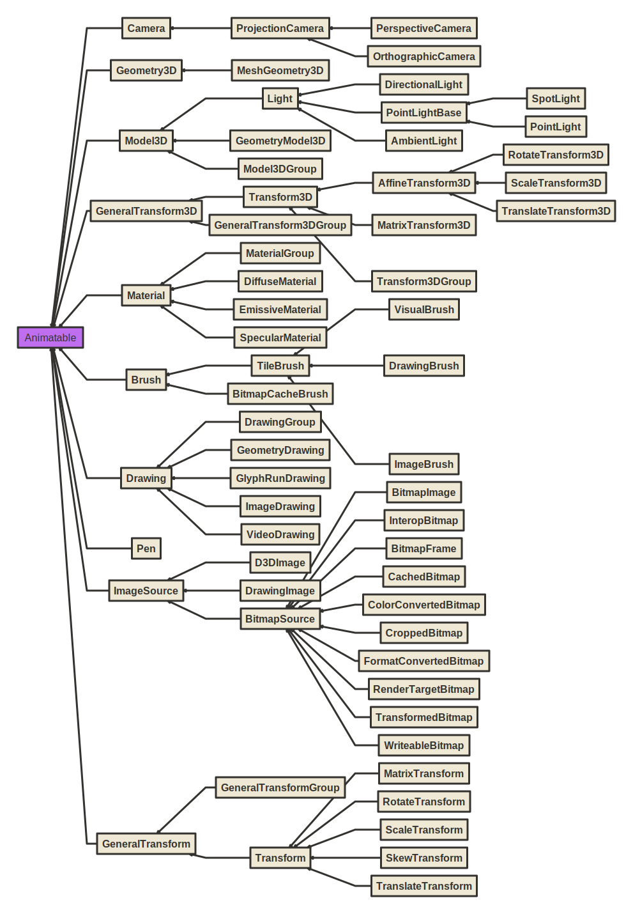

<hr class="pagebreak">

* **Brush**

	Defines objects used to fill the interiors of graphical shapes such as rectangles, ellipses, pies, polygons, and paths.
	
* **Drawing**

	Abstract class that describes a 2-D drawing. This class cannot be inherited by your code.
	
* **ImageSource**

	Represents an object type that has a width, height, and ImageMetadata such as a BitmapSource and a DrawingImage. This is an abstract class.
	
* **BitmapSource**

	Represents a single, constant set of pixels at a certain size and resolution.

* **Transform**

    Defines functionality that enables transformations in a 2-D plane. Transformations include rotation (RotateTransform), scale (ScaleTransform), skew (SkewTransform), and translation (TranslateTransform). This class hierarchy differs from the Matrix structure because it is a class and it supports animation and enumeration semantics.

* **Material**

    Abstract base class for materials. Materials provide texture to 3-D geometries. Combined with a light source, a material makes a 3-D surface visible in the scene.

* **Model3D**
    
    Provides functionality for 3-D models. Use the ModelVisual3D class to render Model3D objects. You can compose Model3D objects by using a Model3DGroup to form a single model. You can share Model3D objects among ModelVisual3D objects to make multiple instances in a scene.

* **Geometry3D**

    Classes that derive from this abstract base class define 3D geometric shapes. The Geometry3D class of objects can be used for hit-testing and rendering 3D graphic data.

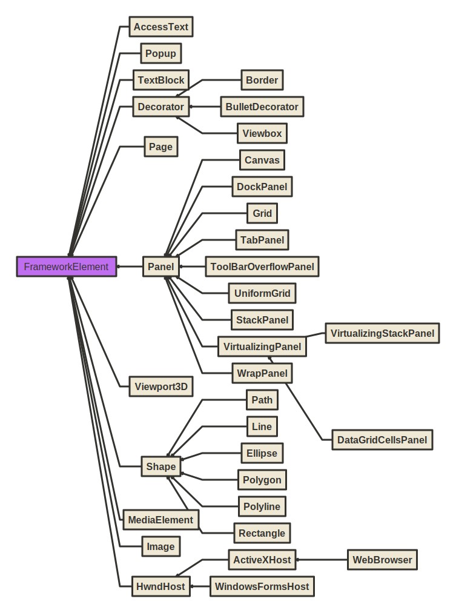

* **Decorator**

    Provides a base class for elements that apply effects onto or around a single child element, such as Border or Viewbox.

* **Page**

    Encapsulates a page of content that can be navigated to and hosted by Windows Internet Explorer, NavigationWindow, and Frame.

* **Panel**

    Provides a base class for all Panel elements. Use Panel elements to position and arrange child objects in Windows Presentation Foundation (WPF) applications.

* **Shape**

    * **Canvas**: Defines an area within which you can explicitly position child elements by using coordinates that are relative to the Canvas area.

    * **DockPanel**: Defines an area where you can arrange child elements either horizontally or vertically, relative to each other.

    * **Grid**: Defines a flexible grid area that consists of columns and rows.
    
    *  **TabPanel**: Handles the layout of the TabItem objects on a TabControl.
    
    *  **ToolBarOverflowPanel**: Used to arrange overflow ToolBar items.
    
    *  **UniformGrid**: Provides a way to arrange content in a grid where all the cells in the grid have the same size.
    
    *  **StackPanel**: Arranges child elements into a single line that can be oriented horizontally or vertically.
   
    *  **VirtualizingPanel**: Provides a framework for Panel elements that virtualize their child data collection. This is an abstract class.
    
    *  **WrapPanel**: Positions child elements in sequential position from left to right, breaking content to the next line at the edge of the containing box. Subsequent ordering happens sequentially from top to bottom or from right to left, depending on the value of the Orientation property.


* **MediaElement**

    Represents a control that contains audio and/or video. When distributing media with your application, you cannot use a media file as a project resource. In your project file, you must instead set the media type to Content and set CopyToOutputDirectory to PreserveNewest or Always.

* **HwndHost**

    Hosts a Win32 window as an element within Windows Presentation Foundation (WPF) content.

* **ContentControl**

    Represents a control with a single piece of content of any type. The ContentControl can contain any type of common language runtime object (such as a string or a DateTime object) or a UIElement object (such as a Rectangle or a Panel).

* **ItemsControl**

    Represents a control that can be used to present a collection of items. An ItemsControl is a type of Control that can contain multiple items, such as strings, objects, or other elements.

* **Selector**

    Represents a control that allows a user to select items from among its child elements.

* **RangeBase**

    Represents an element that has a value within a specific range.

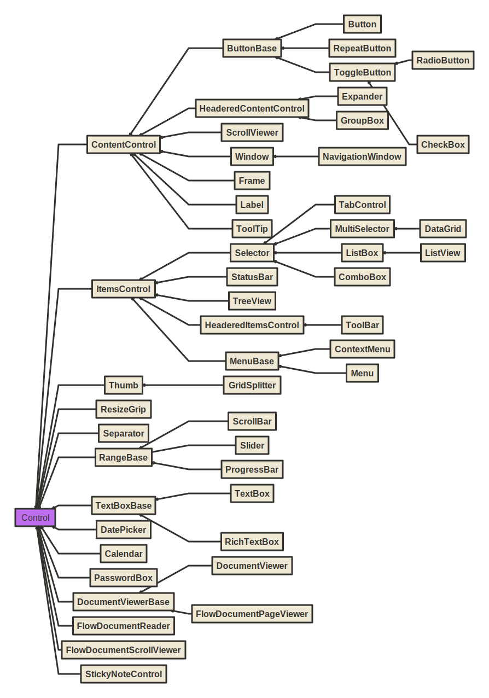

## Windows Froms class hierarchy

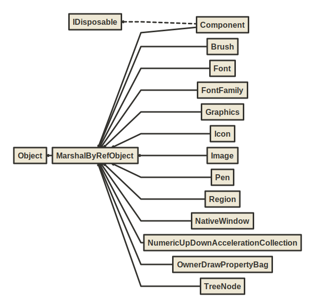

* **MarshalByRefObject**

    Enables access to objects across application domain boundaries in applications that support remoting.

* **Component**

    Provides the base implementation for the IComponent interface and enables object sharing between applications. Component is the base class for all components in the common language runtime that marshal by reference. Component is remotable and derives from the MarshalByRefObject class. Component provides an implementation of the IComponent interface. The MarshalByValueComponent provides an implementation of IComponent that marshals by value.


* **NativeWindow**

    Provides a low-level encapsulation of a window handle and a window procedure. This class automatically manages window class creation and registration. A window is not eligible for garbage collection when it is associated with a window handle. To ensure proper garbage collection, handles must either be destroyed manually using DestroyHandle or released using ReleaseHandle.

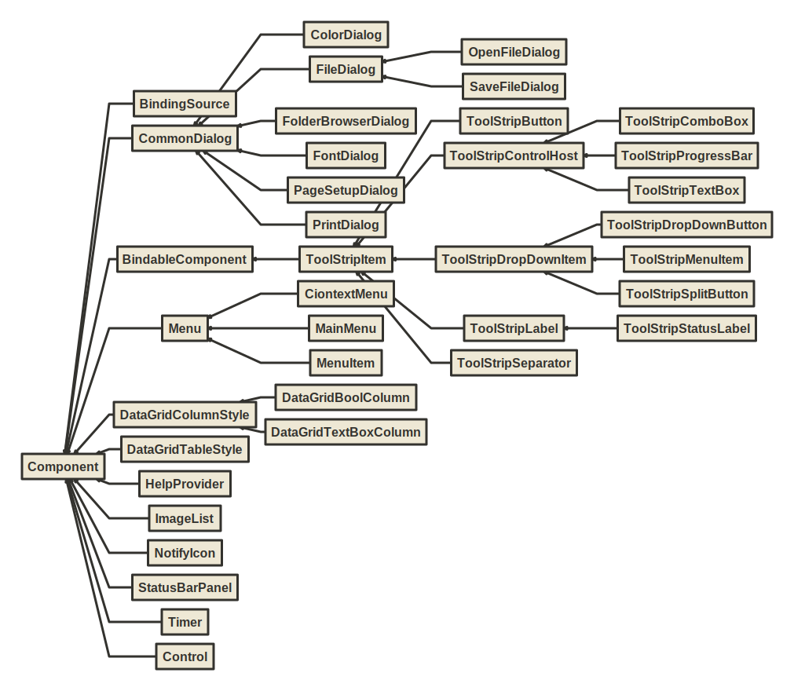

* **BindableComponent**

    Base class for components that provide properties that can be data bound with the Windows Forms Designer.

* **ToolStripItem**

    Represents the abstract base class that manages events and layout for all the elements that a ToolStrip or ToolStripDropDown can contain.

* **CommonDialog**

    Specifies the base class used for displaying dialog boxes on the screen. Inherited classes are required to implement RunDialog by invoking ShowDialog to create a specific common dialog box. Inherited classes can optionally override HookProc to implement specific dialog box hook functionality.

* **Control**

    Defines the base class for controls, which are components with visual representation. The Control class implements very basic functionality required by classes that display information to the user. It handles user input through the keyboard and pointing devices. It handles message routing and security. It defines the bounds of a control (its position and size), although it does not implement painting. It provides a window handle (hWnd).

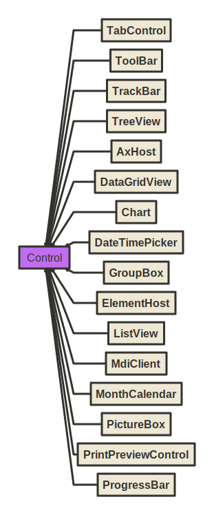

* **AxHost**

    Wraps ActiveX controls and exposes them as fully featured Windows Forms controls.

* **MdiClient**

    Represents the container for multiple-document interface (MDI) child forms. This class cannot be inherited.

* **ElementHost**

    A Windows Forms control that can be used to host a Windows Presentation Foundation (WPF) element.

* **ScrollableControl**

    Defines a base class for controls that support auto-scrolling behavior. To enable a control to display scroll bars as needed, set the AutoScroll property to true and set the AutoScrollMinSize property to the desired size. When the control is sized smaller than the specified minimum size, or a child control is located outside the bounds of the control, the appropriate scroll bars are displayed.


* **ContainerControl**

    Provides focus-management functionality for controls that can function as a container for other controls. The container control can capture the TAB key press and move focus to the next control in the collection.

* **Panel**

    Used to group collections of controls. You can use a Panel to group collections of controls such as a group of RadioButton controls. As with other container controls such as the GroupBox control, if the Panel control's Enabled property is set to false, the controls contained within the Panel will also be disabled.

* **ThreadExceptionDialog**

    Implements a dialog box that is displayed when an unhandled exception occurs in a thread. **This API supports the product infrastructure and is not intended to be used directly from your code.**

* **UserControl**

    The UserControl gives you the ability to create controls that can be used in multiple places within an application or organization. You can include all the code needed for validation of common data you ask the user to input.

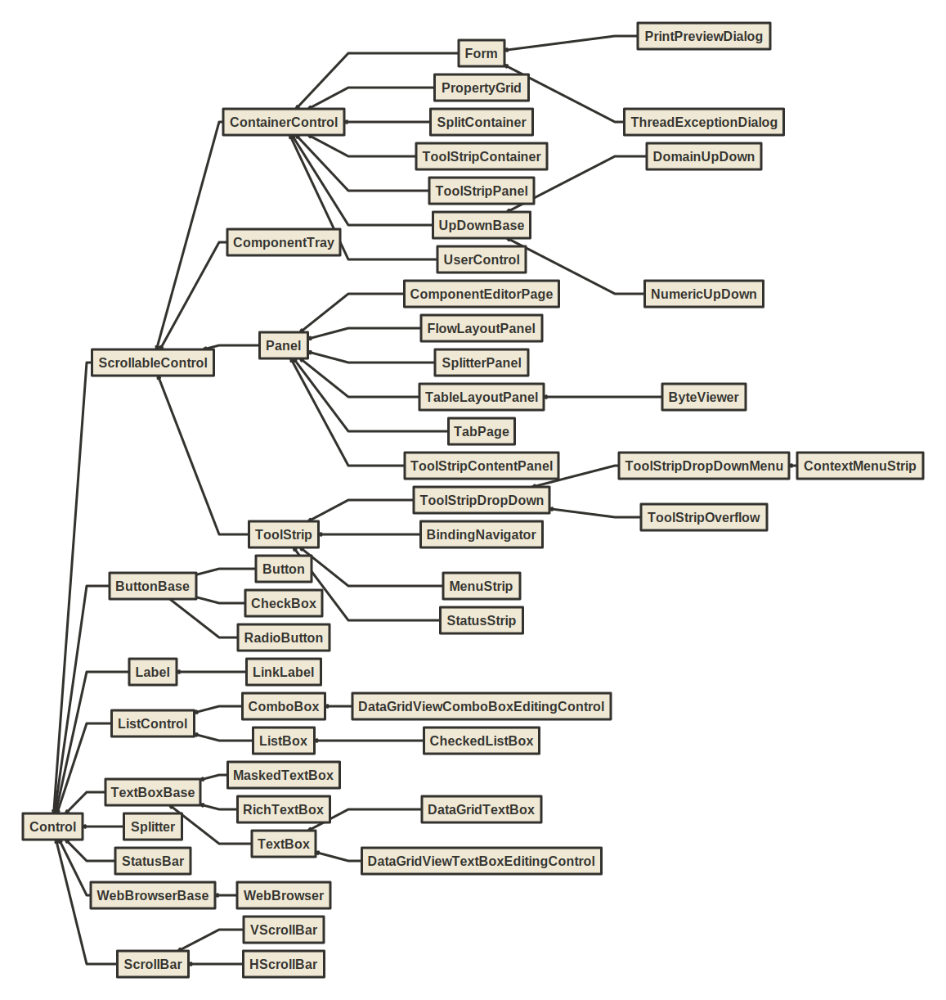

:::
:::
