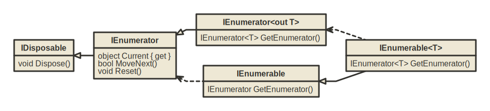
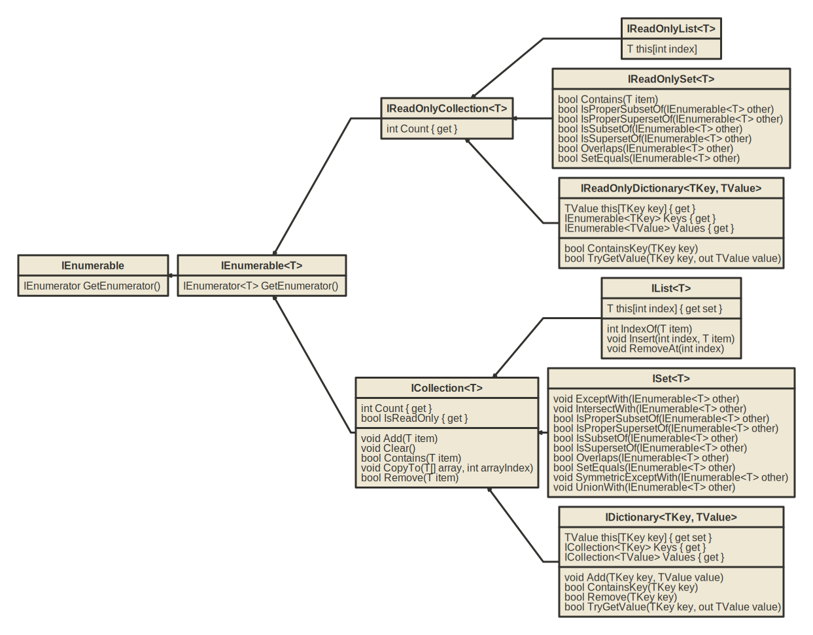

# Ultimate .NET Cheat sheet


## Authors

* Ruzsinszki Gábor - https://www.linkedin.com/in/gabor-ruzsinszki-b564a8181/

## License

This work is licensed under a [Creative Commons Attribution-ShareAlike 4.0 International License](https://creativecommons.org/licenses/by-sa/4.0/).

The .NET copyright of the .NET authors. - https://github.com/dotnet/brand

 

## Changelog

* 2023.04.11 - Initial release 

# Dotnet basic commands

* Check .NET version: `dotnet --version`
* List installed .NET SDKs: `dotnet --list-sdks`
* Show up-to-date status of installed .NET SDKs and .NET Runtimes: `dotnet sdk check`

## New

* Create new gitignore file in current dir: `dotnet new gitignore`
* Create new editorconfig file in current dir: `dotnet new editorconfig`
* Create new solution with name: `dotnet new  sln -n "Name of solution"`
* Create new class libary: `dotnet new classlib -n "Name of lib"`
* Create new console app: `dotnet new console -n "Program name"`
* Create new nunit test project: `dotnet new nunit -n "test project name"`
* Create new xunit test project: `dotnet new xunit -n "test project name"`

## Solution management

* List projects in solution: `dotnet sln [solution.sln] list `
* Add project to solution: `dotnet sln [solution.sln] add [project.csproj]`
* Remove project from solution: `dotnet sln [solution.sln] remove [project.csproj]`  

Note: solution file name can be ignored if folder only contains one sln file.

## Package management

* List package references for project: `dotnet list [project.csproj] package`
* List package references for solution: `dotnet list [solution.sln] package`
* Add or update a package reference: `dotnet add [project.csproj] package [packagename]`
* Remove a package reference: `dotnet remove [project.csproj] package [packagename]`
* Restore package dependencies of project: `dotnet restore [project.csproj]`
* Restore package dependencies of solution: `dotnet restore [solution.sln]`
* Pack current project to nuget package: `dotnet pack [project.csproj]`

## Build & Run

* Build solution in debug mode: `dotnet build [solution.sln] -c DEBUG`
* Build solution in release mode: `dotnet build [solution.sln]  -c RELEASE`
* Build project in debug mode: `dotnet build [project.csproj] -c DEBUG`
* Build project in release mode: `dotnet build [project.csproj]  -c RELEASE`
* Clean output of a project: `dotnet clean [project.csproj]`
* Clean output of a solution: `dotnet clean [solution.sln]`
* Run a compiled assembly: `dotnet run [assembly.dll]`
* Run tests: `dotnet test [testproject.csproj]` or `dotnet test [solution.sln]`

## Tool management

* Install a tool: `dotnet tool install [tool Name]`
* Install a tool globaly: `dotnet tool install -g [tool Name]`
* List installed tools: `dotnet tool list`
* List globaly installed tools: `dotnet tool list -g`
* Remove a tool: `dotnet tool uninstall [tool Name]`
* Remove a globaly installed tool: `dotnet tool uninstall -g [tool Name]`
* Update a tool: `dotnet tool update [tool Name]`
* Update a globaly installed tool: `dotnet tool update -g [tool Name]`

Globaly means that the tool is installed to the users profile, instead of the current project/solution.

## Usefull tools:

* **csharprepl**

    A cross-platform command line REPL for the rapid experimentation and exploration of C#. It supports intellisense, installing NuGet packages, and referencing local 
    .NET projects and assemblies. Install with: `dotnet tool install -g csharprepl`
	
* **IronPython**

	IronPython is an open-source implementation of the Python programming language that is tightly integrated with .NET. IronPython can use .NET and Python libraries, and other .NET languages can use Python code just as easily. Install with: `dotnet tool install -g IronPython.Console`

# Project file XML settings

* Enable implicit usings:

    ```xml
    <PropertyGroup>
        <ImplicitUsings>enable</ImplicitUsings>
    </PropertyGroup>
    ```

* Enable nullable reference types
    
    ```xml
    <PropertyGroup>
        <Nullable>enable</Nullable>
    </PropertyGroup>
    ```
* Set internals visible to an other project

    ```xml
	<ItemGroup>
		<InternalsVisibleTo Include="ProjectName"/>
	</ItemGroup>
    ```
* Do not append target framework to output path

    ```xml
    <PropertyGroup>
        <AppendTargetFrameworkToOutputPath>false</AppendTargetFrameworkToOutputPath>
    </PropertyGroup>
    ```
* Set Assembly version based on build date (year.month.date)

    ```xml
    <PropertyGroup>
        <Version>$([System.DateTime]::UtcNow.ToString("yyyy")).$([System.DateTime]::UtcNow.ToString("MM")).$([System.DateTime]::UtcNow.ToString("dd")).0</Version>
        <AssemblyVersion>$([System.DateTime]::UtcNow.ToString("yyyy")).$([System.DateTime]::UtcNow.ToString("MM")).$([System.DateTime]::UtcNow.ToString("dd")).0</AssemblyVersion>
        <FileVersion>$([System.DateTime]::UtcNow.ToString("yyyy")).$([System.DateTime]::UtcNow.ToString("MM")).$([System.DateTime]::UtcNow.ToString("dd")).0</FileVersion>
    </PropertyGroup>
    ```

# Basic type system

## Numerical types

|  Type   | bytes  |   Bits   |             Minimum value              |            Maximum  Value             |
| :-----: | :----: | :------: | :------------------------------------: | :-----------------------------------: |
|  byte   |   1    |    8     |                   0                    |                  255                  |
|  sbyte  |   1    |    8     |                  -127                  |                  127                  |
|  short  |   2    |    16    |                -32 768                 |                32 767                 |
| ushort  |   2    |    16    |                   0                    |                65 535                 |
|   int   |   4    |    32    |             -2 147 483 648             |             2 147 483 647             |
|  uint   |   4    |    32    |                   0                    |             4 294 967 295             |
|  long   |   8    |    64    |       -9 223 372 036 854 775 808       |       9 223 372 036 854 775 807       |
|  ulong  |   8    |    64    |                   0                    |      18 446 744 073 709 551 615       |
|  float  |   4    |    32    |      -3.4028235 x 10<sup>38</sup>      |      3.4028235 x 10<sup>38</sup>      |
| double  |   8    |    64    | -1.7976931348623157 x 10<sup>308</sup> | 1.7976931348623157 x 10<sup>308</sup> |
| decimal |   16   |   128    |        -7.92 x 10 <sup>28</sup>        |        7.92 x 10 <sup>28</sup>        |
|  Half   |   2    |    16    |                -65 504                 |                65 504                 |
|  nint   | 4 or 8 | 32 or 64 |   platform dependent signed integer    |   platform dependent signed integer   |
|  nuint  | 4 or 8 | 32 or 64 |  platform dependent unsigned integer   |  platform dependent unsigned integer  |

Note: `nint` and `nuint` represent the platforms native integer type. For 32 bit systems this will be a 32 bit integer, so the limitations and properties of `int`
 or `uint` aplies. On 64 bit systems the limitations and properties of `long` and `ulong` applies.

**Smallest representable number in floating types, that is not zero:**

* `decimal`: 1.0 x 10<sup>-28</sup>
* `double` : 5.0 x 10<sup>-324</sup>
* `float` : 1.0 x 10<sup>-45</sup>
* `Half`: 6.0 x 10<sup>-8</sup>

## Numerical types provided by .NET

* **System.Numerics.BigInteger** : Represents an arbitrarily large signed integer.
* **System.Numerics.Complex** : Represents a complex number.
* **System.Numerics.Matrix3x2** : Represents a 3x2 matrix.
* **System.Numerics.Matrix4x4** : Represents a 4x4 matrix.
* **System.Numerics.Plane** : Represents a plane in three-dimensional space.
* **System.Numerics.Quaternion** : Represents a vector that is used to encode three-dimensional physical rotations.
* **System.Numerics.Vector2** : Represents a vector with two single-precision floating-point values.
* **System.Numerics.Vector3** : Represents a vector with three single-precision floating-point values.
* **System.Numerics.Vector4** : Represents a vector with four single-precision floating-point values.

## Geneeric Math Interfaces

|              Interface / Type              | Sbyte, Int16, Int32, Int64 | Int128 | Byte, UInt16, UInt32, UInt64 | UInt128 | Half, Single, Double | Decimal | Complex | BigInteger |
| :----------------------------------------: | :------------------------: | :----: | :--------------------------: | :-----: | :------------------: | :-----: | :-----: | :--------: |
|  `IAdditionOperators<TSelf,TSelf,TSelf>`   |             🟢              |   🟢    |              🟢               |    🟢    |          🟢           |    🟢    |    🟢    |     🟢      |
|      `IAdditiveIdentity<TSelf,TSelf>`      |             🟢              |   🟢    |              🟢               |    🟢    |          🟢           |    🟢    |    🟢    |     🟢      |
|      `IBinaryFloatingPointIeee754<T>`      |             🟢              |        |                              |         |                      |         |         |            |
|            `IBinaryInteger<T>`             |             🟢              |   🟢    |              🟢               |    🟢    |          🟢           |         |         |            |
|             `IBinaryNumber<T>`             |             🟢              |   🟢    |              🟢               |    🟢    |          🟢           |    🟢    |         |            |
|   `IBitwiseOperators<TSelf,TSelf,TSelf>`   |             🟢              |   🟢    |              🟢               |    🟢    |          🟢           |    🟢    |         |            |
|              `IComparable<T>`              |             🟢              |   🟢    |              🟢               |    🟢    |          🟢           |    🟢    |    🟢    |            |
|  `IComparisonOperators<TSelf,TSelf,bool>`  |             🟢              |   🟢    |              🟢               |    🟢    |          🟢           |    🟢    |    🟢    |            |
|               `IConvertible`               |             🟢              |   🟢    |              🟢               |    🟢    |                      |         |         |            |
|          `IDecrementOperators<T>`          |             🟢              |   🟢    |              🟢               |    🟢    |          🟢           |    🟢    |    🟢    |     🟢      |
|  `IDivisionOperators<TSelf,TSelf,TSelf>`   |             🟢              |   🟢    |              🟢               |    🟢    |          🟢           |    🟢    |    🟢    |     🟢      |
|   `IEqualityOperators<TSelf,TSelf,bool>`   |             🟢              |   🟢    |              🟢               |    🟢    |          🟢           |    🟢    |    🟢    |     🟢      |
|              `IEquatable<T>`               |             🟢              |   🟢    |              🟢               |    🟢    |          🟢           |    🟢    |    🟢    |     🟢      |
|         `IExponentialFunctions<T>`         |             🟢              |        |                              |         |                      |         |         |            |
|            `IFloatingPoint<T>`             |             🟢              |   🟢    |                              |         |                      |         |         |            |
|        `IFloatingPointConstants<T>`        |             🟢              |   🟢    |                              |         |                      |         |         |            |
|         `IFloatingPointIeee754<T>`         |             🟢              |        |                              |         |                      |         |         |            |
|         `IHyperbolicFunctions<T>`          |             🟢              |        |                              |         |                      |         |         |            |
|          `IIncrementOperators<T>`          |             🟢              |   🟢    |              🟢               |    🟢    |          🟢           |    🟢    |    🟢    |     🟢      |
|         `ILogarithmicFunctions<T>`         |             🟢              |        |                              |         |                      |         |         |            |
|             `IMinMaxValue<T>`              |             🟢              |   🟢    |              🟢               |    🟢    |          🟢           |    🟢    |         |            |
|   `IModulusOperators<TSelf,TSelf,TSelf>`   |             🟢              |   🟢    |              🟢               |    🟢    |          🟢           |    🟢    |    🟢    |            |
|   `IMultiplicativeIdentity<TSelf,TSelf>`   |             🟢              |   🟢    |              🟢               |    🟢    |          🟢           |    🟢    |    🟢    |     🟢      |
|  `IMultiplyOperators<TSelf,TSelf,TSelf>`   |             🟢              |   🟢    |              🟢               |    🟢    |          🟢           |    🟢    |    🟢    |     🟢      |
|                `INumber<T>`                |             🟢              |   🟢    |              🟢               |    🟢    |          🟢           |    🟢    |    🟢    |            |
|              `INumberBase<T>`              |             🟢              |   🟢    |              🟢               |    🟢    |          🟢           |    🟢    |    🟢    |     🟢      |
|               `IParsable<T>`               |             🟢              |   🟢    |              🟢               |    🟢    |          🟢           |    🟢    |    🟢    |     🟢      |
|            `IPowerFunctions<T>`            |             🟢              |        |                              |         |                      |         |         |            |
|            `IRootFunctions<T>`             |             🟢              |        |                              |         |                      |         |         |            |
|     `IShiftOperators<ulong,int,ulong>`     |             🟢              |   🟢    |              🟢               |    🟢    |          🟢           |         |         |            |
|             `ISignedNumber<T>`             |             🟢              |   🟢    |              🟢               |    🟢    |          🟢           |         |         |            |
|             `ISpanParsable<T>`             |             🟢              |   🟢    |              🟢               |    🟢    |          🟢           |    🟢    |    🟢    |     🟢      |
| `ISubtractionOperators<TSelf,TSelf,TSelf>` |             🟢              |   🟢    |              🟢               |    🟢    |          🟢           |    🟢    |    🟢    |     🟢      |
|        `ITrigonometricFunctions<T>`        |             🟢              |        |                              |         |                      |         |         |            |
|   `IUnaryNegationOperators<TSelf,TSelf>`   |             🟢              |   🟢    |              🟢               |    🟢    |          🟢           |    🟢    |    🟢    |     🟢      |
|     `IUnaryPlusOperators<TSelf,TSelf>`     |             🟢              |   🟢    |              🟢               |    🟢    |          🟢           |    🟢    |    🟢    |     🟢      |
|            `IUnsignedNumber<T>`            |             🟢              |   🟢    |                              |         |                      |         |         |            |

# Operator Precedence

1. parentheses: `()`
2. Postfix Increment and Decrement: `++`, `--`
3. Prefix Increment, Decrement and Unary: `++`, `--`, `+`, `-`, `!`, `~`
4. Multiplicative: `*`, `/`, `%`
5. Additive: `+`, `-`
6. Shift: `<<`, `>>`, `>>>`
7. Relational: `<`, `<=`, `>`, `>=`
8. Equality: `==`, `!=`
9. Bitwise AND: `&`
10. Bitwise XOR: `^`
11. Bitwise OR: `|`
12. Logical AND: `&&`
13. Logical OR: `||`
14. Ternary: `? :`
15. Assignment: `=`, `+=`, `-=`, `*=`, `/=`, `%=`, `&=`, `|=`, `^=`, `<<=`, `>>=`

# Strings

## String escape sequences

| Escape sequence |                           Character name                            |
| :-------------: | :-----------------------------------------------------------------: |
|      `\'`       |                            Single quote                             |
|       `\`       |                            Double quote                             |
|      `\\`       |                              Backslash                              |
|      `\0`       |                                Null                                 |
|      `\a`       |                                Alert                                |
|      `\b`       |                              Backspace                              |
|      `\f`       |                              Form feed                              |
|      `\n`       |                              New line                               |
|      `\r`       |                           Carriage return                           |
|      `\t`       |                           Horizontal tab                            |
|      `\v`       |                            Vertical tab                             |
|      `\u`       |      Unicode escape sequence (UTF-16) followed by 4 hex digits      |
|      `\U`       |      Unicode escape sequence (UTF-32) followed by 8 hex digits      |
|      `\x`       | Unicode escape sequence similar to "\u" except with variable length |

## Numeric format strings

| Format specifier |    Name     |         Supported          |                                             Desription                                              |
| :--------------: | :---------: | :------------------------: | :-------------------------------------------------------------------------------------------------: |
|    `C` or `c`    |  Currency   |     All numeric types      |                                      Formats value as currency                                      |
|    `D` or `d`    |   Decimal   |       Integral types       |                             Integer digits with optional negative sign.                             |
|    `E` or `e`    | Exponential |     All numeric types      |                                        Exponential notation                                         |
|    `F` or `f`    | Fixed-point |     All numeric types      |                      Integral and decimal digits with optional negative sign.                       |
|   `G` or  `g`    |   General   |     All numeric types      |                   The more compact of either fixed-point or scientific notation.                    |
|    `N` or `n`    |   Number    |     All numeric types      | Integral and decimal digits, group separators, and a decimal separator with optional negative sign. |
|    `P` or `p`    |   Percent   |     All numeric types      |                    Number multiplied by 100 and displayed with a percent symbol.                    |
|    `R` or `r`    | Round-trip  | Single, Double, BigInteger |                        A string that can round-trip to an identical number.                         |
|    `X` or `x`    | Hexadecimal |       Integral types       |                                        A hexadecimal string.                                        |
|    any other     |   Unknown   |     All numeric types      |                               Throws a `FormatException` at run time.                               |

## Custom numeric format strings

| Format specifier |                     Name                     |                                                        Desription                                                         |
| :--------------: | :------------------------------------------: | :-----------------------------------------------------------------------------------------------------------------------: |
|       `0`        |               Zero placeholder               |      Replaces the zero with the corresponding digit if one is present; otherwise, zero appears in the result string.      |
|       `#`        |              Digit placeholder               | Replaces the "#" symbol with the corresponding digit if one is present; otherwise, no digit appears in the result string. |
|       `.`        |                Decimal point                 |                          Determines the location of the decimal separator in the result string.                           |
|       `,`        | Group separator, number scaling <sup>I</sup> |                             Serves as both a group separator and a number scaling specifier.                              |
|       `%`        |            Percentage placeholder            |                Multiplies a number by 100 and inserts a localized percentage symbol in the result string.                 |
|       `‰`        |            Per mille placeholder             |                Multiplies a number by 1000 and inserts a localized per mille symbol in the result string.                 |
|       `E0`       |      Exponential notation <sup>II</sup>      |                   If followed by at least one 0 (zero), formats the result using exponential notation.                    |
|       `\`        |       Escape character <sup>III</sup>        |            Causes the next character to be interpreted as a literal rather than as a custom format specifier.             |
|       `;`        |       Section separator <sup>IV</sup>        |                  Defines sections with separate format strings for positive, negative, and zero numbers.                  |
|    any other     |             All other characters             |                                  The character is copied to the result string unchanged.                                  |


**I**: . As a group separator, it inserts a localized group separator character between each group. As a number scaling specifier, it divides a number
 by 1000 for each comma specified.

**II**: The case of "E" or "e" indicates the case of the exponent symbol in the result string. The number of zeros following the "E" or "e" character determines
 the minimum number of digits in the exponent. A plus sign (+) indicates that a sign character always precedes the exponent. 
 A minus sign (-) indicates that a sign character precedes only negative exponents.

**III**: The `#`, `0`, `.`, `,`, `%`, and `‰` symbols in a format string are interpreted as format specifiers rather than as literal characters. 
Depending on their position in a custom format string, the uppercase and lowercase "E" as well as the + and - symbols may also be interpreted as format specifiers.

**IV**: The semicolon (;) is a conditional format specifier that applies different formatting to a number depending on whether its value is positive, negative, or zero. 
To produce this behavior, a custom format string can contain up to three sections separated by semicolons. These sections are:

* One section:
  The format string applies to all values.

* Two sections:
  The first section applies to positive values and zeros, and the second section applies to negative values.

  If the number to be formatted is negative, but becomes zero after rounding according to the format in the second section,
  the resulting zero is formatted according to the first section.

* Three sections:
  The first section applies to positive values, the second section applies to negative values, and the third section applies to zeros.

  The second section can be left empty (by having nothing between the semicolons), in which case the first section applies to all nonzero values.

  If the number to be formatted is nonzero, but becomes zero after rounding according to the format in the first or second section,
  the resulting zero is formatted according to the third section.

## Standard date and time format strings

| Format specifier |              Description              |      Example (en-Us culture)      |
| :--------------: | :-----------------------------------: | :-------------------------------: |
|       `d`        |          Short date pattern           |             6/15/2009             |
|       `D`        |           Long date pattern           |       Monday, June 15, 2009       |
|       `f`        |  Full date/time pattern (short time)  |   Monday, June 15, 2009 1:45 PM   |
|       `F`        |  Full date/time pattern (long time)   | Monday, June 15, 2009 1:45:30 PM  |
|       `g`        | General date/time pattern (long time) |       6/15/2009 1:45:30 PM        |
|    `m` or `M`    |           Month/day pattern           |              June 15              |
|    `O` or `o`    |     Round-trip date/time pattern      | 2009-06-15T13:45:30.0000000-07:00 |
|    `R` or `r`    |            RFC1123 pattern            |     Mon, 15 Jun 2009 20:45:30     |
|       `s`        |      Sortable date/time pattern       |        2009-06-15T13:45:30        |
|       `t`        |          Short time pattern           |              1:45 PM              |
|       `T`        |           Long time pattern           |            1:45:30 PM             |
|       `u`        | Universal sortable date/time pattern  |       2009-06-15 13:45:30Z        |
|       `U`        |   Universal full date/time pattern    | Monday, June 15, 2009 8:45:30 PM  |
|    `Y` or `y`    |          Year month pattern           |             June 2009             |

## Custom date and time format strings

| Format specifier |                             Description                             |
| :--------------: | :-----------------------------------------------------------------: |
|       `d`        |              The day of the month, from 1 through 31.               |
|       `dd`       |              The day of the month, from 01 through 31               |
|      `ddd`       |             The abbreviated name of the day of the week             |
|      `dddd`      |                The full name of the day of the week                 |
|   `g` or `gg`    |                          The period or era                          |
|       `h`        |            The hour, using a 12-hour clock from 1 to 12             |
|       `hh`       |            The hour, using a 12-hour clock from 01 to 12            |
|       `H`        |            The hour, using a 24-hour clock from 0 to 23             |
|       `HH`       |            The hour, using a 24-hour clock from 00 to 23            |
|       `K`        |                        Time zone information                        |
|       `m`        |                    The minute, from 0 through 59                    |
|       `mm`       |                   The minute, from 00 through 59                    |
|       `M`        |                    The month, from 1 through 12                     |
|       `MM`       |                    The month, from 01 through 12                    |
|      `MMM`       |                  The abbreviated name of the month                  |
|      `MMMM`      |                     The full name of the month                      |
|       `s`        |                    The second, from 0 through 59                    |
|       `ss`       |                   The second, from 00 through 59                    |
|       `t`        |             The first character of the AM/PM designator             |
|       `tt`       |                        The AM/PM designator                         |
|       `y`        |                       The year, from 0 to 99                        |
|       `yy`       |                       The year, from 00 to 99                       |
|      `yyy`       |              The year, with a minimum of three digits               |
|      `yyyy`      |                   The year as a four-digit number                   |
|     `yyyyy`      |                   The year as a five-digit number                   |
|       `z`        |            Hours offset from UTC, with no leading zeros             |
|       `zz`       | Hours offset from UTC, with a leading zero for a single-digit value |
|      `zzz`       |                  Hours and minutes offset from UTC                  |
|       `:`        |                         The time separator                          |
|       `/`        |                         The date separator                          |
|       `\`        |                        The escape character                         |

# Common exceptions

|               Type               |                                  Description                                   | Trhow it? |
| :------------------------------: | :----------------------------------------------------------------------------: | :-------: |
|           `Exception`            |                         Base class for all exceptions.                         |    No     |
|    `IndexOutOfRangeException`    |        Thrown by the runtime only when an array is indexed improperly.         |    No     |
|     `NullReferenceException`     |          Thrown by the runtime only when a null object is referenced.          |    No     |
|   `InvalidOperationException`    |                  Thrown by methods when in an invalid state.                   |    Yes    |
|       `ArgumentException`        |                    Base class for all argument exceptions.                     |    No     |
|     `ArgumentNullException`      |          Thrown by methods that do not allow an argument to be null.           |    Yes    |
|  `ArgumentOutOfRangeException`   |       Thrown by methods that verify that arguments are in a given range.       |    Yes    |
|          `IOException`           |                        Thrown when an I/O error occurs.                        |    No     |
|      `OutOfMemoryException`      | Thrown when there is not enough memory to continue the execution of a program. |    No     |
| `PlatformNotSupportedException ` |          Thrown when a feature does not run on a particular platform.          |    Yes    |
|     `NotSupportedException`      |                 Thrown when an invoked method is not supported                 |    Yes    |


Note: The "Trhow it" column indicates whether you should or shouldn't throw that specific exception. An exception handler that cathes
every type of `Exception` should only exist at one place in your program: In the main method as the last barier, to log & report application crashes.
Please also note that, you shouldn't specifically catch any of the exceptions featured in the table above, because they usually denote programming errors.

You can throw the `NotSupportedException` from your code, but if you need to do this, then there might be some other problem with your object model abstraction. 
The need for throwing `NotSupportedException` usally indicates the violation of the Liskov substitution principle.

# Collections





|                 Type                 |                                Description                                |                                Is                                |
| :----------------------------------: | :-----------------------------------------------------------------------: | :--------------------------------------------------------------: |
|                `T[]`                 |                            Represents an Array                            |                  `IList<T>`, `IReadonlyList<T>`                  |
|              `List<T>`               | Represents a strongly typed list of objects that can be accessed by index |                  `IList<T>`, `IReadonlyList<T>`                  |
|      `Dictionary<TKey, TValue>`      |                Represents a collection of keys and values                 | `IReadOnlyDictionary<TKey, TValue>`, `IDictionary<TKey, TValue>` |
|             `HashSet<T>`             |                        Represents a set of values                         |                   `ISet<T>`, `IReadOnlySet<T>`                   |
|              `Queue<T>`              |                Represents a first-in, first-out collection                |            `ICollection<T>`, `IReadOnlyCollection<T>`            |
| `PriorityQueue<TElement, TPriority>` |       On Dequeue the item with the lowest priority value is removed       |                                --                                |
|              `Stack<T>`              |      Represents a variable size last-in-first-out (LIFO) collection       |            `ICollection<T>`, `IReadOnlyCollection<T>`            |
|           `LinkedList<T>`            |                      Represents a doubly linked list                      |            `ICollection<T>`, `IReadOnlyCollection<T>`            |


## Concurent Collections

|                Type                 |                               Description                               |                                Is                                 |
| :---------------------------------: | :---------------------------------------------------------------------: | :---------------------------------------------------------------: |
|       `BlockingCollection<T>`       | Provides blocking and bounding capabilities for thread-safe collections |                     `IReadOnlyCollection<T>`                      |
|         `ConcurrentBag<T>`          |        Represents a thread-safe, unordered collection of objects        |    `IReadOnlyCollection<T>`, `IProducerConsumerCollection<T>`     |
| `ConcurrentDictionary<TKey,TValue>` |         Represents a thread-safe collection of key/value pairs          | `IReadOnlyDictionary<TKey,TValue>`,  ` IDictionary<TKey,TValue> ` |
|        `ConcurrentQueue<T>`         |      Represents a thread-safe first in-first out (FIFO) collection      |    `IReadOnlyCollection<T>`, `IProducerConsumerCollection<T>`     |
|        `ConcurrentStack<T>`         |      Represents a thread-safe last in-first out (LIFO) collection       |    `IReadOnlyCollection<T>`, `IProducerConsumerCollection<T>`     |

# LINQ

## Filtering

```csharp
var customerOrders = Orders.Where(order => order.CustomerId == 66);
```

## Select with anonymus type

```csharp
var ordersWithCost = Orders.Select(order => new
{
    OrderId = order.Id,
    Cost = order.Cost,
});
```

## Ordering

```csharp
var ascendingOrder = orders.OrderBy(order => order.Cost);
var descendingOrder = orders.OrderByDescending(order => order.Cost);

var multipleOdering = orders.OrderBy(order => order.Cost).ThenBy(order => order.CustomerId);
```

## Join

```csharp
var joined = customers.Join(orders, 
                            customer => customer.Id, 
                            order => order.CustomerId
                            (customer, order) => new
                            {
                                CustomerId = customer.Id,
                                Name = customer.Name,
                                Cost = order.Cost, 
                            });
```

## Grouping

```csharp
var grouped = orders.GroupBy(order => CustomerId);
```

## Skip & Take

```csharp
var take3 = orders.Take(3);
var next3 = orders.Skip(3).Take(3);
```

## Element operations

```csharp
//throws exception if element not found
var firstCustomer = customers.First(customer => customer.Id == 63);
var lastCustomer = customers.Last(customer => customer.Id == 63);

//returns default value if element not found
var firstCustomer = customers.FirstOrDefault(customer => customer.Id == 63);
var lastCustomer = customers.LastOrDefault(customer => customer.Id == 63);
```

## Conversions

```csharp
Order[] orders = Orders.Where(order => order.CustomerId == 66).ToArray();
List<Order> orders = Orders.Where(order => order.CustomerId == 66).ToList();
HashSet<Order> orders = Orders.Where(order => order.CustomerId == 66).ToHashSet();
Dictionary<int, string> customerDictionary = Customers.ToDictionary(customer => customer.Id, customer => customer.Name);
```

# Pattern matching

## Discard pattern

The discard pattern can be used to match any expression, including `null`. It's represented by the `_` symbol.

```csharp
bool isFloatingPointNumber(string input)
{
    //the out value of the conversion is discarded
    return double.TryParse(input, out double _);
}
```

## var pattern

The `var` pattern can be used to match any expression, including `null`, and assign its result to a new local variable:

```csharp
bool isFloatingPointNumber(string input)
{
    return double.TryParse(input, out var _);
}
```

## Declaration and type patterns

```csharp
object greeting = "Hello, World!";
if (greeting is string message)
{
	//greeting is a string and casted to message variable
}
```

A declaration pattern with type T matches an expression when an expression result is non-null and any of the following conditions are true:

* The run-time type of an expression result is T.
* The run-time type of an expression result derives from type T, implements interface T, or another implicit reference conversion exists from it to T.

**Null checking:**

```csharp
if (input is not null)
{
    // ...
}
```

**Type checking in switch:**

```csharp
public abstract class Vehicle {}
public class Car : Vehicle {}
public class Truck : Vehicle {}

public static class TollCalculator
{
    public static decimal CalculateToll(this Vehicle vehicle) => vehicle switch
    {
        Car _ => 2.00m,
        Truck _ => 7.50m,
        null => throw new ArgumentNullException(nameof(vehicle)),
        _ => throw new ArgumentException("Unknown type of a vehicle", nameof(vehicle)),
    };
}
```

## Constant pattern

```csharp
public static decimal GetGroupTicketPrice(int visitorCount) => visitorCount switch
{
    1 => 12.0m,
    2 => 20.0m,
    3 => 27.0m,
    4 => 32.0m,
    0 => 0.0m,
    _ => throw new ArgumentException($"Not supported number of visitors: {visitorCount}", nameof(visitorCount)),
};
```

In a constant pattern, you can use any constant expression, such as integers, floating-point numbers, char, string, boolean, enums, 
name of a declared const field or local and null.

Note: `Span<char>` or `ReadOnlySpan<char>` can also be matched in the constant pattern, but in C# 11 and later versions

## Relational patterns

```csharp
static string Classify(double measurement) => measurement switch
{
    < -4.0 => "Too low",
    > 10.0 => "Too high",
    double.NaN => "Unknown",
    _ => "Acceptable",
};
```

In a relational pattern, you can use any of the relational operators `<`, `>`, `<=`, or `>=`. The right-hand part of a relational pattern must be
a constant expression. For the constant expression, the constant pattern limitations apply.

## Logical patterns

```csharp
static string Classify(double measurement) => measurement switch
{
    < -40.0 => "Too low",
    >= -40.0 and < 0 => "Low",
    >= 0 and < 10.0 => "Acceptable",
    >= 10.0 and < 20.0 => "High",
    >= 20.0 => "Too high",
    double.NaN => "Unknown",
};

static string GetCalendarSeason(DateTime date) => date.Month switch
{
    3 or 4 or 5 => "spring",
    6 or 7 or 8 => "summer",
    9 or 10 or 11 => "autumn",
    12 or 1 or 2 => "winter",
    _ => throw new ArgumentOutOfRangeException(nameof(date), $"Date with unexpected month: {date.Month}."),
};
```

Precedence: `not`, `and`, `or`. To explicitly specify the precedence, use parentheses:

```csharp
static bool IsLetter(char c) => c is (>= 'a' and <= 'z') or (>= 'A' and <= 'Z');
```

## Property Pattern

```csharp
static bool IsConferenceDay(DateTime date) => date is { Year: 2020, Month: 5, Day: 19 or 20 or 21 };
```

A property pattern matches an expression when an expression result is non-null and every nested pattern matches the corresponding property or field 
of the expression result. It can be combined with run-time type check and variable declaration:

```csharp
static string TakeFive(object input) => input switch
{
    string { Length: >= 5 } s => s.Substring(0, 5),
    string s => s,

    ICollection<char> { Count: >= 5 } symbols => new string(symbols.Take(5).ToArray()),
    ICollection<char> symbols => new string(symbols.ToArray()),

    null => throw new ArgumentNullException(nameof(input)),
    _ => throw new ArgumentException("Not supported input type."),
};
```

## Positional pattern

You use a positional pattern to deconstruct an expression result and match the resulting values against the corresponding nested patterns.

```csharp
public readonly struct Point
{
    public int X { get; }
    public int Y { get; }

    public Point(int x, int y) => (X, Y) = (x, y);

    public void Deconstruct(out int x, out int y) => (x, y) = (X, Y);
}

static string Classify(Point point) => point switch
{
    (0, 0) => "Origin",
    (1, 0) => "positive X basis end",
    (0, 1) => "positive Y basis end",
    _ => "Just a point",
};
```

At the preceding example, the type of an expression contains the Deconstruct method, which is used to deconstruct an expression result. 
You can also match expressions of tuple types against positional patterns. In that way, you can match multiple inputs against various patterns:

```csharp
static decimal GetGroupTicketPriceDiscount(int groupSize, DateTime visitDate)
    => (groupSize, visitDate.DayOfWeek) switch
    {
        (<= 0, _) => throw new ArgumentException("Group size must be positive."),
        (_, DayOfWeek.Saturday or DayOfWeek.Sunday) => 0.0m,
        (>= 5 and < 10, DayOfWeek.Monday) => 20.0m,
        (>= 10, DayOfWeek.Monday) => 30.0m,
        (>= 5 and < 10, _) => 12.0m,
        (>= 10, _) => 15.0m,
        _ => 0.0m,
    };
```

## List patterns

```csharp
int[] numbers = { 1, 2, 3 };

numbers is [1, 2, 3]; //true
numbers is [1, 2, 4]; //false
numbers is [1, 2, 3, 4]; //false
numbers is [0 or 1, <= 2, >= 3]; //true
```
