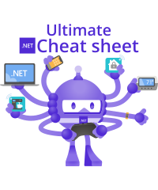

# Ultimate .NET cheat sheet

## Authors

* Ruzsinszki Gábor - https://www.linkedin.com/in/gabor-ruzsinszki-b564a8181/

## License

This work is licensed under a [Creative Commons Attribution-ShareAlike 4.0 International License](https://creativecommons.org/licenses/by-sa/4.0/).

The .NET Logo is copyright of the .NET authors. - https://github.com/dotnet/brand

 

The project is open-source and available on GitHub. You can contribute to it by visiting project's GitHub repository: https://github.com/webmaster442/ultimatedotnetcheatsheet
