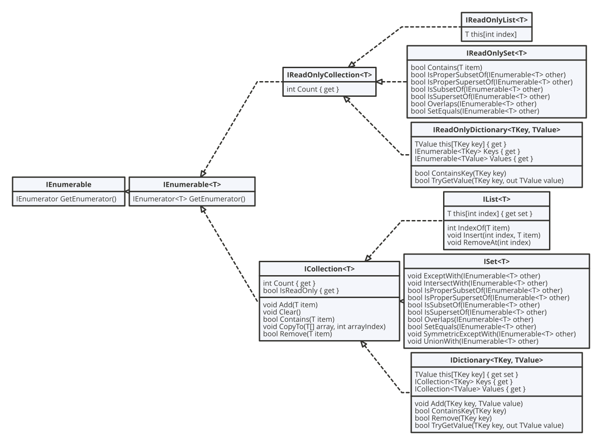

# Collections

^^^

^^^ collection interfaces

## Generic collections

* `Dictionary<TKey,TValue>`

  Represents a collection of keys and values.

* `OrderedDictionary<TKey,TValue>`

  Represents a collection of key/value pairs that are accessible by the key or index.

* `SortedDictionary<TKey,TValue>` - Represents a collection of key/value pairs that are sorted on the key.
* `SortedList<TKey,TValue>`

  Represents a collection of key/value pairs that are sorted by key based on the associated `IComparer<T>` implementation.

* `HashSet<T>`

  Represents a set of values.

* `LinkedList<T>`

  Represents a doubly linked list.

* `List<T>`

  Represents a strongly typed list of objects that can be accessed by index. Provides methods to search, sort, and manipulate lists.

* `PriorityQueue<TElement,TPriority>`

  Represents a collection of items that have a value and a priority. On dequeue, the item with the lowest priority value is removed.

* `Queue<T>`

  Represents a first-in, first-out collection of objects.

* `SortedSet<T>`

  Represents a collection of objects that is maintained in sorted order.

* `Stack<T>`

  Represents a variable size last-in-first-out (LIFO) collection of instances of the same specified type.

## Frozen Collections

Frozen collections are types that provide immutable, read-only collections optimized for fast lookup and enumeration.

* `FrozenDictionary<TKey,TValue>`

  Provides an immutable, read-only dictionary optimized for fast lookup and enumeration. It has a relatively high cost to create but provides excellent lookup performance. Thus, it is ideal for cases where a dictionary is created once, potentially at the startup of an application, and is used throughout the remainder of the life of the application.

* `FrozenSet<T>`

  Provides an immutable, read-only set optimized for fast lookup and enumeration. It has a relatively high cost to create but provides excellent lookup performance. Thus, it is ideal for cases where a set is created once, potentially at the startup of an application, and is used throughout the remainder of the life of the application.

## Immutable Collections

* `ImmutableArray<T>`

  Represents an array that is immutable, meaning it can't be changed once it's created.

* `ImmutableDictionary<TKey,TValue>`

  Represents an immutable, unordered collection of keys and values.

* `ImmutableHashSet<T>`

  Represents an immutable, unordered hash set.

* `ImmutableList<T>`

  Represents an immutable list, which is a strongly typed list of objects that can be accessed by index.

* `ImmutableQueue<T>`

  Represents an immutable queue.

* `ImmutableSortedDictionary<TKey,TValue>`

  Represents an immutable sorted dictionary.

* `ImmutableSortedSet<T>`

  Represents an immutable sorted set implementation.

* `ImmutableStack<T>`

  Represents an immutable stack.

## Concurent collections

* `BlockingCollection<T>`

  Provides blocking and bounding capabilities for thread-safe collections that implement `IProducerConsumerCollection<T>`.

* `ConcurrentBag<T>`

  Represents a thread-safe, unordered collection of objects.

* `ConcurrentDictionary<TKey,TValue>`

  Represents a thread-safe collection of key/value pairs that can be accessed by multiple threads concurrently.

* `ConcurrentQueue<T>`

  Represents a thread-safe first in-first out (FIFO) collection.

* `ConcurrentStack<T>`

  Represents a thread-safe last in-first out (LIFO) collection.
  