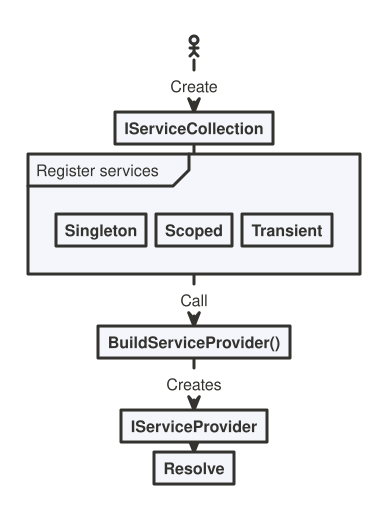
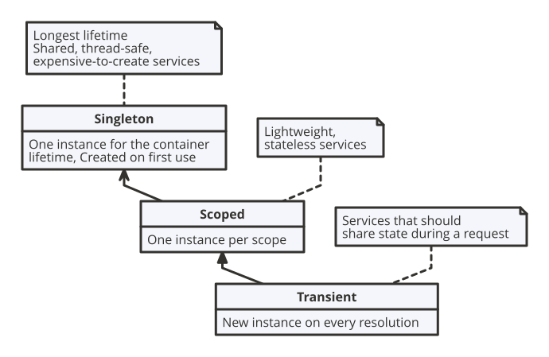
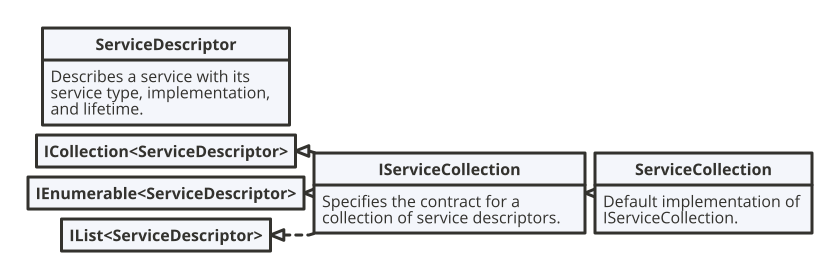

# Dependency Injection

Dependency Injection (DI) is a design pattern where a class receives its dependencies (for example, services it needs) from the outside instead of creating them itself, which improves testability, flexibility, and separation of concerns. 

In modern .NET, `Microsoft.Extensions.DependencyInjection` is the go-to standard container because it is built into ASP.NET Core. The DI stack is intentionally split into an abstractions package: `Microsoft.Extensions.DependencyInjection.Abstractions` and an implementation package:`Microsoft.Extensions.DependencyInjection`.

^^^

^^^ Dependency Injection Workflow

## Service lifetime

^^^

^^^ Service lifetimes

Sope: In ASP.NET one HTTP request one scope.

## Dependency injection guidelines

* Avoid stateful, static classes and members. Avoid creating global state by designing apps to use singleton services instead.
* Avoid direct instantiation of dependent classes within services. Direct instantiation couples the code to a particular implementation.
* Make services small, well-factored, and easily tested.
* The container is responsible for cleanup of types it creates, and calls Dispose on IDisposable instances. Services resolved from the container should never be disposed by the developer. The container disposes services automatically based on their lifetime:
  * Transient and scoped services are disposed at the end of the scope in which they were resolved. In apps that process requests, this is typically at the end of the request.
  * Singleton services are disposed when the service container is disposed, usually at application shutdown.
* Don't register `IDisposable` instances with a transient lifetime. Use the factory pattern instead so the solved service can be manually disposed when it's no longer in use.
* Don't resolve `IDisposable` instances with a transient or scoped lifetime in the root scope. The only exception to this is if the app creates or recreates and disposes IServiceProvider, but this isn't an ideal pattern.
* Receiving an `IDisposable` dependency via DI doesn't require that the receiver implement `IDisposable` itself. The receiver of the `IDisposable` dependency shouldn't call `Dispose()` on that dependency.
* Use scopes to control the lifetimes of services. Scopes aren't hierarchical, and there's no special connection among scopes.

## Service Registration

^^^

^^^ Dependency Registratgion related types

Rule of thumb: Avoid Captive dependencies! A captive dependency happens when a service with a longer lifetime captures a service with a shorter lifetime.

```csharp
public class MyService
{
    private readonly MyDbContext _dbContext;

    public MyService(MyDbContext dbContext)
    {
        _dbContext = dbContext;
    }
}

services.AddScoped<MyDbContext>();
//captive dependency, since MyService is singleton
services.AddSingleton<MyService>();
```

In this example this is bad, because an instance of `MyDbContext` outlives the scope and will not be disposed.

| Depender  | Dependency |       State        |
| :-------: | :--------: | :----------------: |
| Sigleton  |  Sigleton  |        Okay        |
| Sigleton  |   Scoped   | Captive dependency |
| Sigleton  | Transient  | Captive dependency |
|  Scoped   |  Sigleton  |        Okay        |
|  Scoped   |   Scoped   |        Okay        |
|  Scoped   | Transient  | Captive dependency |
| Transient | Singleton  |        Okay        |
| Transient |   Scoped   |        Okay        |
| Transient | Transient  |        Okay        |

## Service Resolve

^^^

^^^ Dependency Resolve related types

